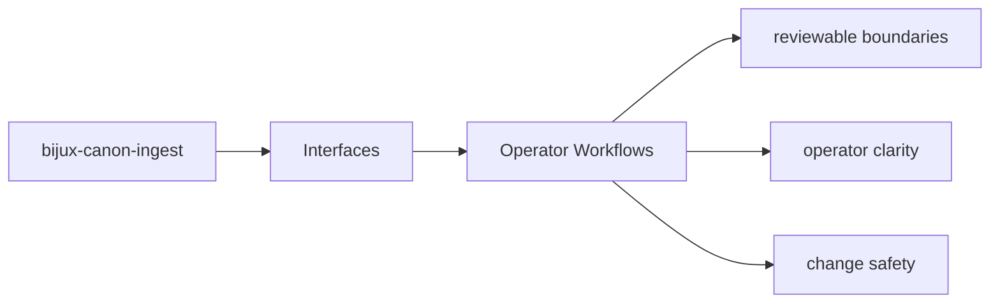
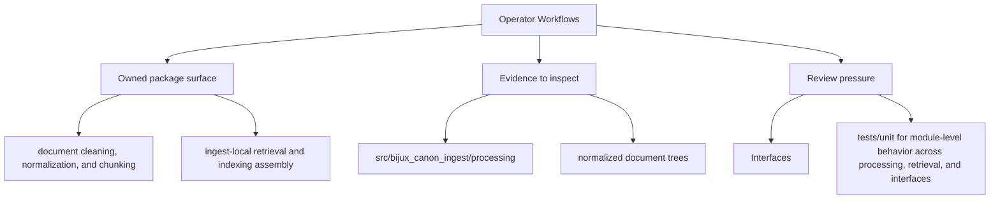

# Operator Workflows

Operator workflows should start from documented package entrypoints and end in reviewable outputs.

Read the interfaces pages for `bijux-canon-ingest` as the bridge between implementation and caller expectations: they should make public surfaces legible before a downstream dependency is formed.

## Page Maps

## Workflow Anchors

- entry surfaces: CLI entrypoint in src/bijux_canon_ingest/interfaces/cli/entrypoint.py, HTTP boundaries under src/bijux_canon_ingest/interfaces, configuration modules under src/bijux_canon_ingest/config
- durable outputs: normalized document trees, chunk collections and retrieval-ready records, diagnostic output produced during ingest workflows
- validation backstops: tests/unit for module-level behavior across processing, retrieval, and interfaces, tests/e2e for package boundary coverage

## Concrete Anchors

- CLI entrypoint in src/bijux_canon_ingest/interfaces/cli/entrypoint.py
- HTTP boundaries under src/bijux_canon_ingest/interfaces
- configuration modules under src/bijux_canon_ingest/config
- apis/bijux-canon-ingest/v1/schema.yaml

## Use This Page When

- you need the public command, API, import, or artifact surface
- you are checking whether a caller can rely on a given shape or entrypoint
- you need the contract-facing side of the package before using it

## Decision Rule

Use `Operator Workflows` to decide whether a caller-facing surface is explicit enough to be depended on. If the surface cannot be tied back to concrete code, schemas, artifacts, and tests, it should be treated as unstable until that evidence exists.

## Next Checks

- move to operations when the caller-facing question becomes procedural or environmental
- move to quality when compatibility or evidence of protection becomes the real issue
- move back to architecture when a public-surface question reveals a deeper structural drift

## Update This Page When

- commands, schemas, API modules, imports, or artifacts change in a caller-visible way
- compatibility expectations change or a new contract surface appears
- examples or entrypoints stop matching the actual package boundary

## What This Page Answers

- which public or operator-facing surfaces bijux-canon-ingest exposes
- which artifacts and schemas act like contracts
- what compatibility pressure this surface creates

## Reviewer Lens

- compare commands, API files, imports, and artifacts against the documented surface
- check whether schema or artifact changes need compatibility review
- confirm that operator-facing examples still point at real entrypoints

## Honesty Boundary

This page can identify the intended public surfaces of bijux-canon-ingest, but real compatibility still depends on code, schemas, artifacts, and tests staying aligned.

## Purpose

This page connects package interfaces to the workflows an operator actually performs.

## Stability

Keep it aligned with the existing commands, endpoints, and outputs.

## Core Claim

The interface claim of `bijux-canon-ingest` is that commands, APIs, imports, schemas, and artifacts form a reviewable contract rather than an implied one.

## Why It Matters

If the interface pages for `bijux-canon-ingest` are weak, callers cannot tell which commands, schemas, or artifacts are stable enough to depend on, and compatibility review arrives too late.

## If It Drifts

- callers depend on surfaces that are less stable than the docs imply
- schema and artifact changes stop receiving the compatibility review they need
- operator examples begin pointing at stale or misleading entrypaths

## Representative Scenario

An operator or downstream caller wants to depend on a `bijux-canon-ingest` surface and needs to know which command, API, schema, import, or artifact is stable enough to treat as a contract.

## Source Of Truth Order

- `packages/bijux-canon-ingest/src/bijux_canon_ingest` for the implemented boundary
- `apis/bijux-canon-ingest/v1/schema.yaml` as tracked contract evidence
- `packages/bijux-canon-ingest/tests` for compatibility and behavior proof

## Common Misreadings

- that every visible package surface is equally stable
- that one schema or example is the whole compatibility story
- that interface docs override package code, artifacts, or tests when they disagree
