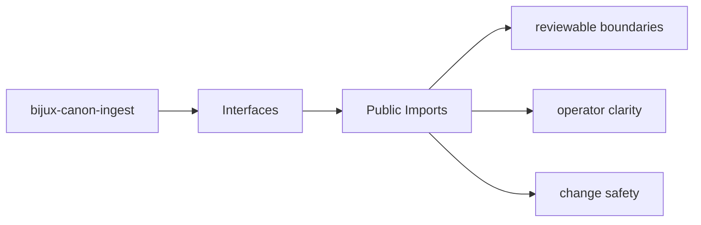
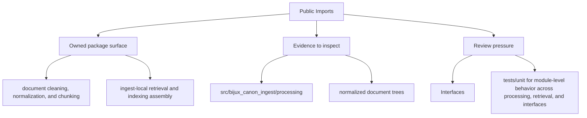

# Public Imports

The public Python surface of `bijux-canon-ingest` starts at the package import root and any
intentionally exported modules beneath it.

## Page Maps

## Import Anchor

- import root: `bijux_canon_ingest`
- package source root: `packages/bijux-canon-ingest/src/bijux_canon_ingest`

## Concrete Anchors

- CLI entrypoint in src/bijux_canon_ingest/interfaces/cli/entrypoint.py
- HTTP boundaries under src/bijux_canon_ingest/interfaces
- configuration modules under src/bijux_canon_ingest/config
- apis/bijux-canon-ingest/v1/schema.yaml

## Use This Page When

- you need the public command, API, import, or artifact surface
- you are checking whether a caller can rely on a given shape or entrypoint
- you need the contract-facing side of the package before using it

## What This Page Answers

- which public or operator-facing surfaces bijux-canon-ingest exposes
- which artifacts and schemas act like contracts
- what compatibility pressure this surface creates

## Reviewer Lens

- compare commands, API files, imports, and artifacts against the documented surface
- check whether schema or artifact changes need compatibility review
- confirm that operator-facing examples still point at real entrypoints

## Honesty Boundary

This page can identify the intended public surfaces of bijux-canon-ingest, but real compatibility still depends on code, schemas, artifacts, and tests staying aligned.

## Purpose

This page keeps the import-facing contract visible when refactoring package internals.

## Stability

Keep it aligned with the actual package source tree and documented import paths.
