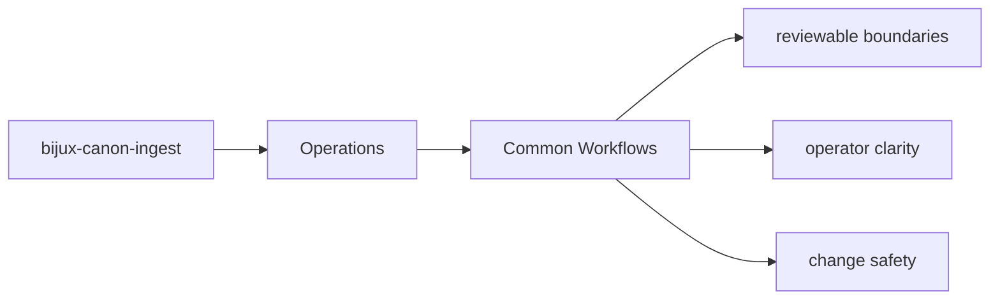

# Common Workflows

Most work on `bijux-canon-ingest` follows one of a few recurring paths.

## Page Maps

## Recurring Paths

- inspect the package README and section indexes first
- follow an interface into the owning module group
- run the owning tests before declaring the change complete

## Code Areas

- `src/bijux_canon_ingest/processing` for deterministic document transforms
- `src/bijux_canon_ingest/retrieval` for retrieval-oriented models and assembly
- `src/bijux_canon_ingest/application` for package workflows
- `src/bijux_canon_ingest/infra` for local adapters and infrastructure helpers
- `src/bijux_canon_ingest/interfaces` for CLI and HTTP boundaries
- `src/bijux_canon_ingest/safeguards` for protective rules for ingest behavior

## Purpose

This page makes common package workflows easier to repeat consistently.

## Stability

Keep it aligned with the actual package structure and tests.
