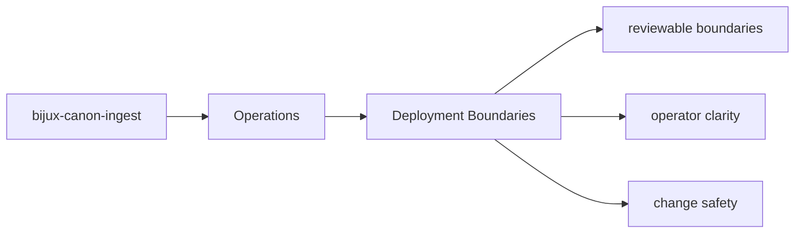

# Deployment Boundaries

Deployment for `bijux-canon-ingest` should respect the package boundary instead of assuming the full repository is always present.

## Page Maps

## Boundary Facts

- package root: `packages/bijux-canon-ingest`
- public metadata: `packages/bijux-canon-ingest/pyproject.toml`
- release notes: `packages/bijux-canon-ingest/CHANGELOG.md` when present

## Purpose

This page reminds maintainers that packages are publishable units, not just folders in one repo.

## Stability

Keep it aligned with the package's actual distributable surface.
