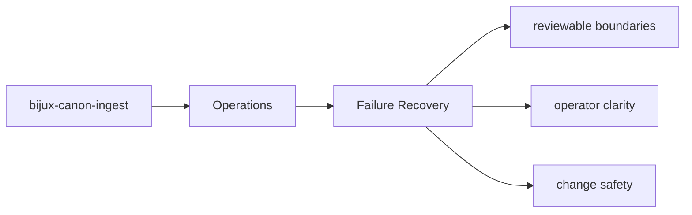

# Failure Recovery

Failure recovery starts with knowing which artifacts, interfaces, and tests expose the problem.

## Page Maps

## Recovery Anchors

- interface surfaces: CLI entrypoint in src/bijux_canon_ingest/interfaces/cli/entrypoint.py, HTTP boundaries under src/bijux_canon_ingest/interfaces, configuration modules under src/bijux_canon_ingest/config
- artifacts to inspect: normalized document trees, chunk collections and retrieval-ready records, diagnostic output produced during ingest workflows
- tests to run: tests/unit for module-level behavior across processing, retrieval, and interfaces, tests/e2e for package boundary coverage

## Purpose

This page gives maintainers a durable frame for triaging package failures.

## Stability

Keep it aligned with the package entrypoints and diagnostic outputs.
