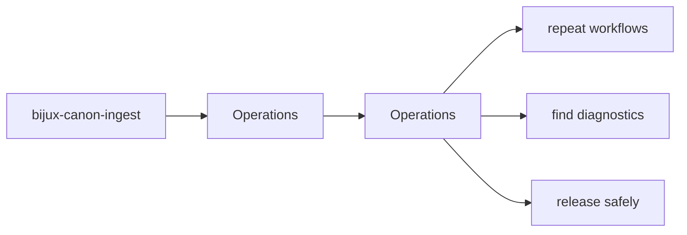
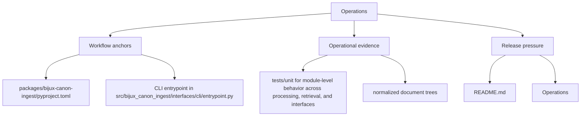

# Operations

Use the operations section when you need to run, diagnose, release, or support `bijux-canon-ingest` without reconstructing the workflow from source.

These pages are the checked-in operating memory for `bijux-canon-ingest`. They should let a maintainer move from setup to diagnosis to release without depending on private habits or half-remembered shell history.

Read the operations pages for `bijux-canon-ingest` as the package's explicit operating memory. They should make common tasks repeatable without forcing maintainers to relearn the workflow from code, CI logs, or oral history.

## Page Maps

## Pages in This Section

- [Installation and Setup](installation-and-setup.md)
- [Local Development](local-development.md)
- [Common Workflows](common-workflows.md)
- [Observability and Diagnostics](observability-and-diagnostics.md)
- [Performance and Scaling](performance-and-scaling.md)
- [Failure Recovery](failure-recovery.md)
- [Release and Versioning](release-and-versioning.md)
- [Security and Safety](security-and-safety.md)
- [Deployment Boundaries](deployment-boundaries.md)

## Read Across the Package

- [Foundation](../foundation/index.md) when you need the package boundary and ownership story
- [Architecture](../architecture/index.md) when the question becomes structural or execution-oriented
- [Interfaces](../interfaces/index.md) when the question becomes caller-facing or contract-facing
- [Quality](../quality/index.md) when the question becomes proof, risk, or review sufficiency

## Concrete Anchors

- `packages/bijux-canon-ingest/pyproject.toml` for package metadata
- `packages/bijux-canon-ingest/README.md` for local package framing
- `packages/bijux-canon-ingest/tests` for executable operational backstops

## Use This Page When

- you are installing, running, diagnosing, or releasing the package
- you need repeatable operational anchors rather than architectural framing
- you are responding to package behavior in local work, CI, or incident pressure

## Decision Rule

Use `Operations` to decide whether a maintainer can repeat the package workflow from checked-in assets instead of memory. If a step works only because someone already knows the trick, the workflow is not documented clearly enough yet.

## Next Checks

- move to interfaces when the operational path depends on a specific surface contract
- move to quality when the question becomes whether the workflow is sufficiently proven
- move back to architecture when operational complexity suggests a structural problem

## Update This Page When

- install, setup, diagnostics, or release behavior changes materially
- package metadata or runtime workflow changes the expected operator path
- new operational constraints appear that a maintainer needs to know before acting

## What This Page Answers

- how `bijux-canon-ingest` is installed, run, diagnosed, and released in practice
- which checked-in files and tests anchor the operational story
- where a maintainer should look first when the package behaves differently

## Reviewer Lens

- verify that setup, workflow, and release statements still match package metadata and current commands
- check that operational guidance still points at real diagnostics and validation paths
- confirm that maintainer advice still works under current local and CI expectations

## Honesty Boundary

This page explains how `bijux-canon-ingest` is expected to be operated, but it does not replace package metadata, actual runtime behavior, or validation in a real environment. A workflow is only trustworthy if a maintainer can still repeat it from the checked-in assets named here.

## Section Contract

- define what the operations section covers for bijux-canon-ingest
- point readers to the topic pages that hold the detailed explanations
- keep the section boundary reviewable as the package evolves

## Reading Advice

- start here when you know the package but not yet the right page inside the section
- use the page list to choose the narrowest topic that matches the current question
- move across sections only after this section stops being the right lens

## Purpose

This page explains how to use the operations section for `bijux-canon-ingest` without repeating the detail that belongs on the topic pages beneath it.

## Stability

This page is part of the canonical package docs spine. Keep it aligned with the current package boundary and the topic pages in this section.

## What Good Looks Like

- `Operations` leaves a maintainer able to repeat the relevant package workflow from checked-in assets
- the operational path is explicit enough that incident pressure does not force guesswork
- release and setup expectations stay aligned with the package metadata and tests

## Failure Signals

- `Operations` only works if the maintainer already knows unstated steps
- package metadata, runtime behavior, and operational docs start telling different stories
- incident handling requires reverse-engineering workflow from code instead of following checked-in guidance

## Tradeoffs To Hold

- prefer repeatable checked-in workflows over locally optimized shortcuts
- prefer diagnosability over hiding operational seams that matter during incidents
- prefer keeping `bijux-canon-ingest` operational memory visible in metadata, docs, and tests over relying on maintainer recall

## Cross Implications

- changes here affect how maintainers and CI interact with `bijux-canon-ingest` across environments
- interface expectations often surface again as operational preconditions or diagnostics
- quality pages must evolve when the operational path changes what counts as sufficient validation

## Approval Questions

- does `Operations` leave a maintainer able to repeat the workflow from checked-in assets
- are install, diagnostics, and release statements still aligned with package metadata and tests
- would this workflow still hold up under time pressure without hidden operator memory

## Evidence Checklist

- verify `packages/bijux-canon-ingest/pyproject.toml` and `packages/bijux-canon-ingest/README.md` still match the operational story
- inspect `packages/bijux-canon-ingest/tests` for the workflow or environment proof the page implies
- compare the documented operating path with the actual steps needed in local or CI use

## Anti-Patterns

- relying on tribal memory for steps that should live in checked-in assets
- documenting the happy path while leaving diagnostics and failure handling implicit
- letting release or setup guidance drift away from package metadata

## Escalate When

- the operational path changes enough to affect CI, releases, or another package's expectations
- the documented workflow depends on environment assumptions that are no longer stable
- incident or release handling can no longer be explained as a package-local concern

## Core Claim

The core operational claim of `bijux-canon-ingest` is that install, run, diagnose, and release paths can be repeated from explicit package assets instead of oral history.

## Why It Matters

If the operations pages for `bijux-canon-ingest` are weak, maintainers end up relearning install, diagnosis, and release from trial and error instead of from checked-in package truth.

## If It Drifts

- maintainers relearn package operation by trial and error
- release and setup steps quietly diverge from the checked-in package metadata
- diagnostic workflows become harder to repeat under incident pressure

## Representative Scenario

A maintainer is trying to run, diagnose, or release `bijux-canon-ingest` under time pressure and needs an explicit path that starts from checked-in metadata and lands in repeatable validation.

## Source Of Truth Order

- `packages/bijux-canon-ingest/pyproject.toml` for install and release metadata that a maintainer can actually execute against
- `packages/bijux-canon-ingest/README.md` and package tests for the shortest checked-in operator truth
- this page for the repeatable workflow narrative that should match those assets rather than drift away from them

## Common Misreadings

- that the shortest operator path is always the most authoritative source of truth
- that setup or release behavior can be inferred safely without checking package metadata
- that one successful local run proves the whole operational contract is intact
