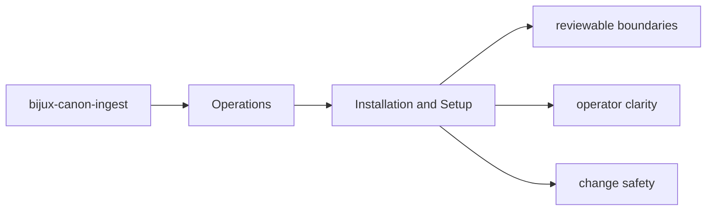

# Installation and Setup

Installation for `bijux-canon-ingest` should start from the package metadata and the specific
optional dependencies that matter for the work being done.

## Page Maps

## Package Metadata Anchors

- package root: `packages/bijux-canon-ingest`
- metadata file: `packages/bijux-canon-ingest/pyproject.toml`
- readme: `packages/bijux-canon-ingest/README.md`

## Dependency Themes

- pydantic
- msgpack
- numpy
- fastapi
- uvicorn
- PyYAML

## Purpose

This page tells maintainers where setup truth actually lives for the package.

## Stability

Keep it aligned with `pyproject.toml` and the checked-in package metadata.
