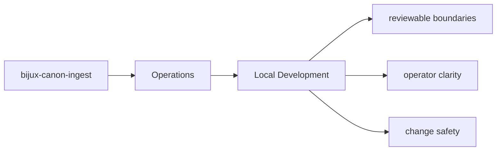

# Local Development

Local development should happen inside `packages/bijux-canon-ingest` with tests and docs updated
in the same change series as the code.

## Page Maps

## Development Anchors

- tests/unit for module-level behavior across processing, retrieval, and interfaces
- tests/e2e for package boundary coverage
- tests/invariants for long-lived repository promises
- tests/eval for corpus-backed behavior checks

## Purpose

This page records the package-local development posture.

## Stability

Keep it aligned with the actual test layout and maintenance workflow.
