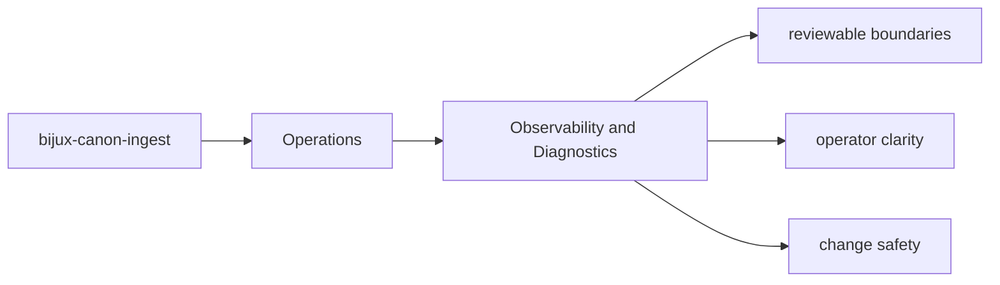
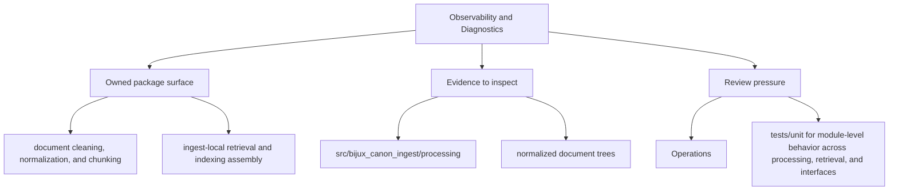

# Observability and Diagnostics

Diagnostics should make it easier to explain what `bijux-canon-ingest` did, not merely that it ran.

## Page Maps

## Diagnostic Anchors

- normalized document trees
- chunk collections and retrieval-ready records
- diagnostic output produced during ingest workflows

## Supporting Modules

- `src/bijux_canon_ingest/processing` for deterministic document transforms
- `src/bijux_canon_ingest/retrieval` for retrieval-oriented models and assembly

## Purpose

This page points readers toward the package's observable output and diagnostic support.

## Stability

Keep it aligned with the package modules and artifacts that currently support diagnosis.
