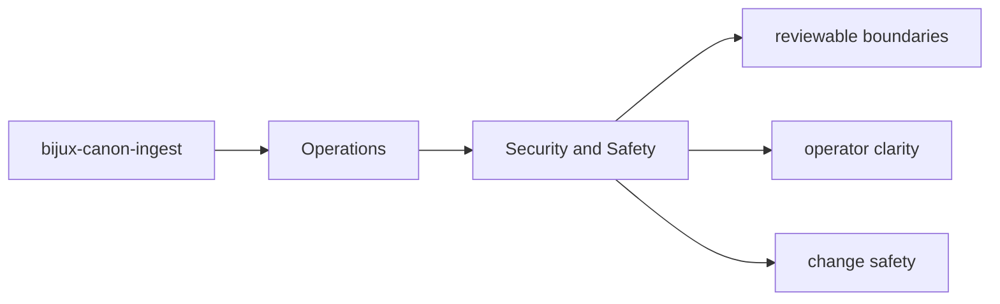

# Security and Safety

Security review in `bijux-canon-ingest` should focus on the package's real boundary surfaces and outputs.

## Page Maps

## Review Anchors

- CLI entrypoint in src/bijux_canon_ingest/interfaces/cli/entrypoint.py
- HTTP boundaries under src/bijux_canon_ingest/interfaces
- configuration modules under src/bijux_canon_ingest/config

## Safety Rule

Any change that broadens package authority should update docs, tests, and release notes together.

## Purpose

This page keeps security review grounded in concrete package seams.

## Stability

Keep it aligned with the package interfaces and operational risk profile.
