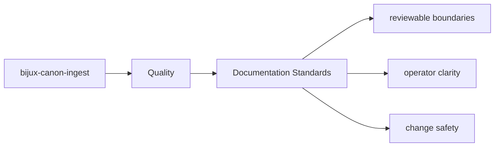
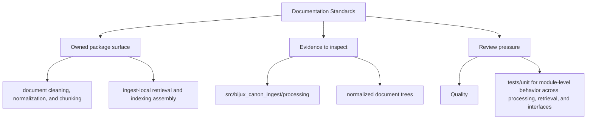

# Documentation Standards

Package docs should stay consistent with the shared handbook layout used across the repository.

## Page Maps

## Standards

- use the shared five-category package spine
- prefer stable filenames that describe durable intent
- keep docs grounded in real code paths, interfaces, and artifacts

## Use This Page When

- you are reviewing tests, invariants, limitations, or risk
- you need evidence that the documented contract is actually protected
- you are deciding whether a change is done rather than merely implemented

## What This Page Answers

- what proves the bijux-canon-ingest contract today
- which risks or limits still need explicit review
- what a reviewer should verify before accepting change

## Purpose

This page keeps package docs from drifting back into ad hoc structure.

## Stability

Update it only when the shared documentation system itself changes.
