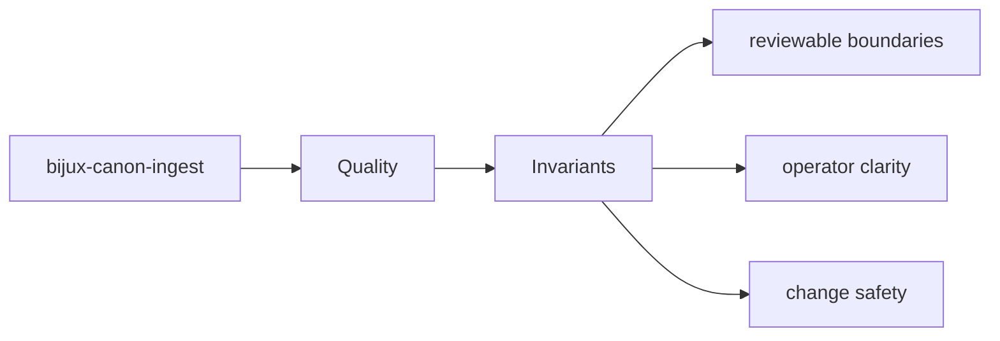

# Invariants

Invariants are the promises that should survive ordinary implementation change.

## Page Maps

## Invariant Anchors

- package boundary stays explicit
- interface and artifact contracts remain reviewable
- tests continue to prove the long-lived promises

## Supporting Tests

- tests/unit for module-level behavior across processing, retrieval, and interfaces
- tests/e2e for package boundary coverage
- tests/invariants for long-lived repository promises
- tests/eval for corpus-backed behavior checks

## Purpose

This page records the kinds of promises that should not drift casually.

## Stability

Keep it aligned with invariant-focused tests and documented package guarantees.
