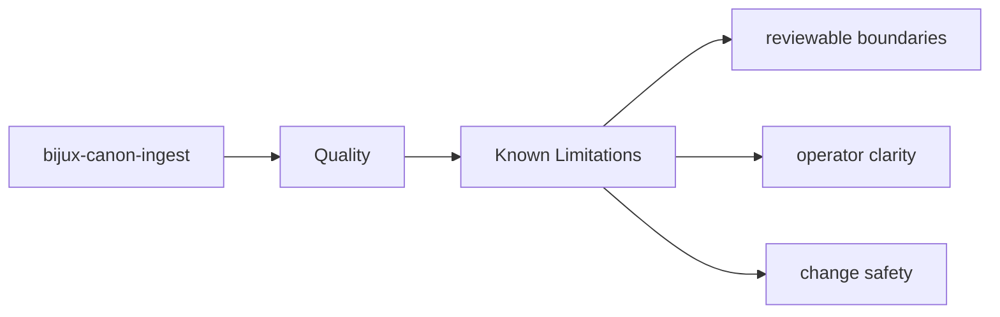
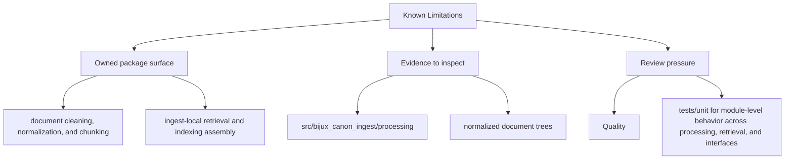

# Known Limitations

No package is improved by pretending its limitations do not exist.

## Page Maps

## Honest Boundaries

- runtime-wide replay authority and persistence
- cross-package vector execution semantics
- repository maintenance automation

## Concrete Anchors

- tests/unit for module-level behavior across processing, retrieval, and interfaces
- tests/e2e for package boundary coverage
- README.md

## Use This Page When

- you are reviewing tests, invariants, limitations, or risk
- you need evidence that the documented contract is actually protected
- you are deciding whether a change is done rather than merely implemented

## Next Checks

- move to foundation when the risk appears to be boundary confusion rather than missing tests
- move to architecture when the proof gap points to structural drift
- move to interfaces or operations when the proof question is really about a contract or workflow

## What This Page Answers

- what proves the bijux-canon-ingest contract today
- which risks or limits still need explicit review
- what a reviewer should verify before accepting change

## Reviewer Lens

- compare the documented proof strategy with the current test layout
- look for limitations or risks that should have been updated by recent changes
- verify that the page's definition of done still reflects real validation practice

## Honesty Boundary

This page explains how bijux-canon-ingest protects itself, but it does not claim that prose alone is enough without the listed tests, checks, and review practice.

## Purpose

This page keeps limitation language attached to the package boundary instead of scattered through issue comments.

## Stability

Keep it aligned with the limitations that remain intentionally true today.

## Core Claim

The quality claim of `bijux-canon-ingest` is that tests, invariants, risks, and completion criteria jointly prove whether the package is trustworthy after change.

## Why It Matters

If the quality pages for `bijux-canon-ingest` are weak, it becomes difficult to tell whether a change is actually safe or merely passes a narrow local test.

## If It Drifts

- reviewers cannot tell whether the listed proof still covers the real risk surface
- limitations stop being visible until they show up as rework later
- definition-of-done language drifts away from actual validation practice

## Representative Scenario

A change appears correct locally, but the reviewer still needs to know whether `bijux-canon-ingest` has actually satisfied its proof obligations before the work is accepted.

## Source Of Truth Order

- `packages/bijux-canon-ingest/tests` for executable proof
- `packages/bijux-canon-ingest/pyproject.toml` for declared package constraints
- this page for the review lens that explains how to read that proof

## Common Misreadings

- that a passing local test automatically satisfies the package review standard
- that documented risks are static and do not need to move with the code
- that the definition of done is only about implementation rather than proof
