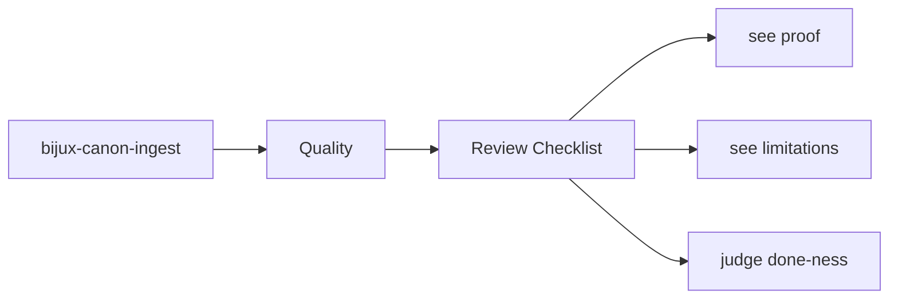
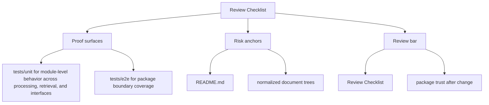

# Review Checklist

Reviewing changes in `bijux-canon-ingest` should include both behavior and documentation.

The checklist is not here to slow people down with ceremony. It is here to stop
fast review from becoming shallow review when a change touches boundaries,
contracts, or proof.

Read the quality pages for `bijux-canon-ingest` as the proof frame around the package. They should explain how trust is earned, how risk stays visible, and why a passing local check is not always enough.

## Page Maps

## Checklist

- did ownership stay inside the correct package boundary
- do interface or artifact changes have matching docs and tests
- are filenames, commit messages, and symbols still clear enough to age well

## Concrete Anchors

- tests/unit for module-level behavior across processing, retrieval, and interfaces
- tests/e2e for package boundary coverage
- README.md

## Use This Page When

- you are reviewing tests, invariants, limitations, or ongoing risks
- you need evidence that the documented contract is actually defended
- you are deciding whether a change is truly done rather than merely implemented

## Decision Rule

Use `Review Checklist` to decide whether `bijux-canon-ingest` has actually earned trust after a change. If one narrow green check hides a wider contract, risk, or validation gap, the work is not done yet.

## What This Page Answers

- what currently proves the `bijux-canon-ingest` contract instead of merely describing it
- which risks, limits, and assumptions still need explicit skepticism
- what a reviewer should be able to say before accepting a change as done

## Reviewer Lens

- compare the documented proof story with the actual test layout and release posture
- look for limitations or risks that should have moved with recent behavior changes
- verify that the claimed done-ness standard still reflects real validation practice

## Honesty Boundary

This page explains how `bijux-canon-ingest` is supposed to earn trust, but it does not claim that prose alone is enough. If the listed tests, checks, and review practice stop backing the story, the story has to change.

## Next Checks

- move to foundation when the risk appears to be boundary confusion rather than missing tests
- move to architecture when the proof gap points to structural drift
- move to interfaces or operations when the proof question is really about a contract or workflow

## Purpose

This page records a compact review lens for package changes.

## Stability

Update it only when the package review posture genuinely changes.
