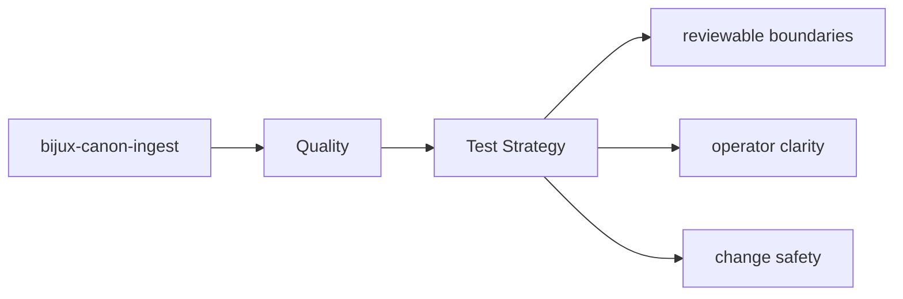

# Test Strategy

The tests for `bijux-canon-ingest` are the executable proof of its package contract.

## Page Maps

## Test Areas

- tests/unit for module-level behavior across processing, retrieval, and interfaces
- tests/e2e for package boundary coverage
- tests/invariants for long-lived repository promises
- tests/eval for corpus-backed behavior checks

## Purpose

This page explains the broad testing shape of the package.

## Stability

Keep it aligned with the real test directories and the behaviors they protect.
