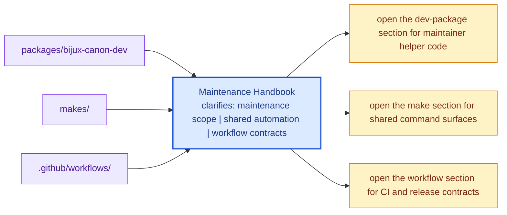

# Maintenance Handbook

The maintenance handbook explains the repository-owned operational surfaces that
do not belong in one product package handbook.

This handbook exists because repository health work is real work. Schema drift
checks, supply-chain helpers, shared Make targets, and CI workflow contracts are
too important to leave half-documented in scripts and logs. They need their own
home so maintainers can review them as first-class parts of the system instead
of as hidden support glue.

The maintenance handbook should make repository-health behavior explicit without
turning it into a shadow product layer. It is strongest when readers can see
what the shared maintenance surfaces do, where they live, and which packages or
rules they affect.

## Visual Summary

## Sections

- [bijux-canon-dev](bijux-canon-dev/index.md) for maintainer package behavior,
  schema drift tooling, release support, SBOM helpers, and repository-health
  guardrails

## Shared Maintenance Anchors

- `packages/bijux-canon-dev` for maintainer helper code
- `makes/` for shared make entrypoints and composition
- `.github/workflows/` for CI, docs, and publication workflow truth

## Use This Page When

- you are changing repository automation, validation, or release support
- you need maintainer-only context that should not live in product package docs
- you are reviewing CI, schema drift, supply-chain, or shared automation

## Decision Rule

Use `Maintenance Handbook` to decide whether a change belongs to repository
maintenance surfaces or to a product package contract. If the change would
affect end-user behavior directly, this handbook should push the review back
toward the owning product package instead of letting maintainer scope sprawl.

## What This Page Answers

- which maintenance section owns the current repository-health concern
- which shared automation surfaces matter for that concern
- what a reviewer should confirm before changing repository automation

## Reviewer Lens

- compare the described maintenance behavior with the actual helper modules,
  make surfaces, and workflow files
- check that maintainer-only guidance has not leaked into product-facing pages
- confirm that repository automation still names its package impact explicitly

## Next Checks

- move to the `bijux-canon-dev` section when the question is about the
  maintainer package itself
- move to product package docs if the question is user-facing behavior rather
  than repository health
- return to repository handbook pages when the issue turns out to be root
  governance rather than maintenance implementation

## Honesty Boundary

This handbook can describe maintainer automation and repository health work, but
it should never imply that maintainer tooling is part of the end-user product
surface. It also should not pretend that hidden scripts count as documentation
just because CI happens to run them.

## Purpose

This page explains how to use the maintenance handbook without confusing it with
user-facing product docs.

## Stability

Keep this page aligned with the actual maintenance sections and shared surfaces
documented in this handbook.
