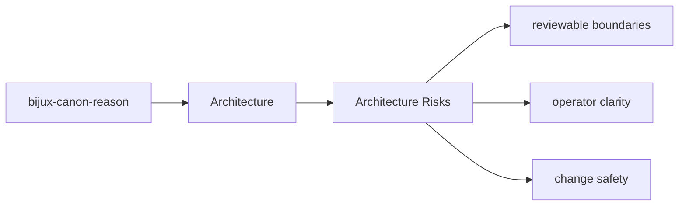
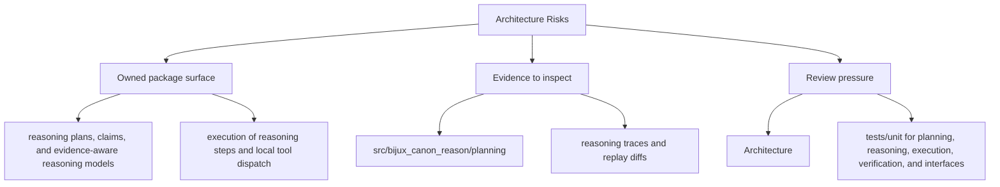

# Architecture Risks

Architectural risk appears when the package boundary becomes hard to explain or hard to test.

## Page Maps

## Risk Signals

- behavior moves into the wrong package because it seems convenient
- interfaces start depending on lower-level implementation details directly
- produced artifacts stop matching their documented contract

## Review Areas

- `src/bijux_canon_reason/planning` for plan construction and intermediate representation
- `src/bijux_canon_reason/reasoning` for claim and reasoning semantics
- `src/bijux_canon_reason/execution` for step execution and tool dispatch
- `src/bijux_canon_reason/verification` for checks and validation outcomes
- `src/bijux_canon_reason/traces` for trace replay and diff support
- `src/bijux_canon_reason/interfaces` for CLI and serialization boundaries

## What This Page Answers

- how bijux-canon-reason is structured internally
- which modules control the main execution path
- where architectural drift would become visible first

## Purpose

This page keeps architectural review focused on durable package risks instead of transient churn.

## Stability

Keep it aligned with the package structure and known review concerns.
