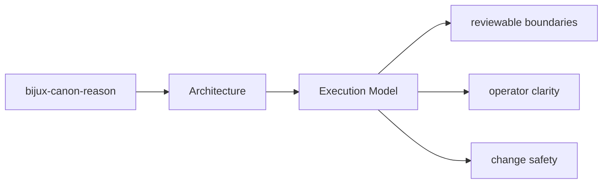
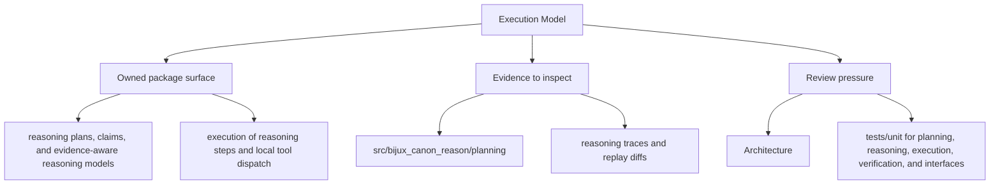

# Execution Model

`bijux-canon-reason` executes work by receiving inputs at its interfaces, coordinating policy
and workflows in application code, and delegating specific responsibilities to owned modules.

## Page Maps

## Execution Anchors

- entry surfaces: CLI app in src/bijux_canon_reason/interfaces/cli, HTTP app in src/bijux_canon_reason/api/v1, schema files in apis/bijux-canon-reason/v1
- workflow modules: src/bijux_canon_reason/planning, src/bijux_canon_reason/reasoning, src/bijux_canon_reason/execution
- outputs: reasoning traces and replay diffs, claim and verification outcomes, evaluation suite artifacts

## Purpose

This page summarizes the package execution model before readers inspect individual modules.

## Stability

Keep it aligned with the actual workflow code and entrypoints.
