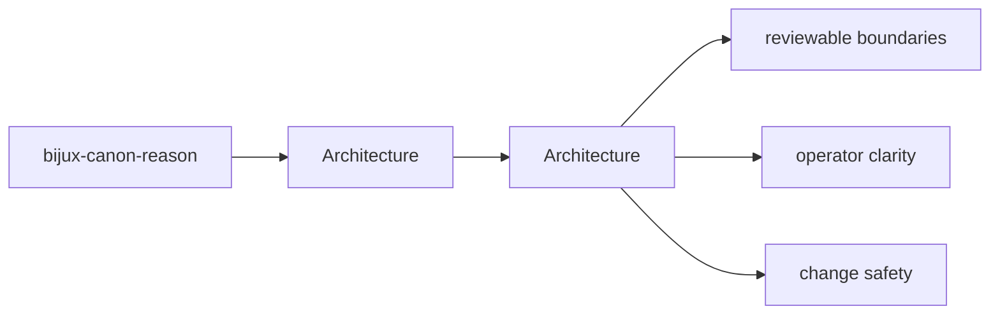
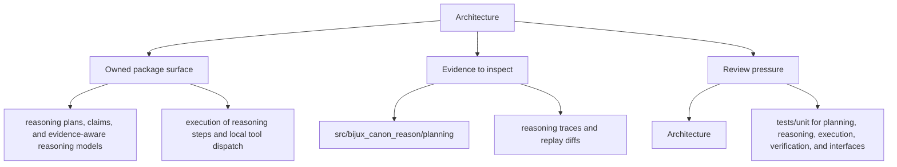

# Architecture

bijux-canon-reason architecture pages describe how modules and responsibilities fit together under `bijux_canon_reason`.

Read the architecture pages for `bijux-canon-reason` as a reviewer-facing map of structure and flow: they should be detailed enough to shorten code reading without pretending to replace it.

## Page Maps

## Pages in This Section

- [Module Map](module-map.md)
- [Dependency Direction](dependency-direction.md)
- [Execution Model](execution-model.md)
- [State and Persistence](state-and-persistence.md)
- [Integration Seams](integration-seams.md)
- [Error Model](error-model.md)
- [Extensibility Model](extensibility-model.md)
- [Code Navigation](code-navigation.md)
- [Architecture Risks](architecture-risks.md)

## Read Across the Package

- [Foundation](../foundation/index.md)
- [Interfaces](../interfaces/index.md)
- [Operations](../operations/index.md)
- [Quality](../quality/index.md)

## Concrete Anchors

- `src/bijux_canon_reason/planning` for plan construction and intermediate representation
- `src/bijux_canon_reason/reasoning` for claim and reasoning semantics
- `src/bijux_canon_reason/execution` for step execution and tool dispatch

## Use This Page When

- you are tracing internal structure or execution flow
- you need to understand where modules fit before refactoring
- you are reviewing architectural drift instead of one local bug

## Next Checks

- move to interfaces when the review reaches a public or operator-facing seam
- move to operations when the concern becomes repeatable runtime behavior
- move to quality when you need proof that the documented structure is still protected

## Update This Page When

- module responsibilities or dependency direction change materially
- new execution pathways or structural seams become important to review
- architectural risk shifts enough that the current map is misleading

## What This Page Answers

- how bijux-canon-reason is structured internally
- which modules control the main execution path
- where architectural drift would become visible first

## Reviewer Lens

- trace the claimed execution path through the listed modules
- look for dependency direction that now contradicts the documented seam
- verify that architectural risks still match the current code structure

## Honesty Boundary

This page describes the current structural model of bijux-canon-reason, but it does not by itself prove that every import or runtime path still obeys that model.

## Section Contract

- define what the architecture section covers for bijux-canon-reason
- point readers to the topic pages that hold the detailed explanations
- keep the section boundary reviewable as the package evolves

## Reading Advice

- start here when you know the package but not yet the right page inside the section
- use the page list to choose the narrowest topic that matches the current question
- move across sections only after this section stops being the right lens

## Purpose

This page explains how to use the architecture section for `bijux-canon-reason` without repeating the detail that belongs on the topic pages beneath it.

## Stability

This page is part of the canonical package docs spine. Keep it aligned with the current package boundary and the topic pages in this section.

## Core Claim

The architectural claim of `bijux-canon-reason` is that its structure is deliberate enough for a reviewer to trace responsibilities, dependencies, and drift pressure without reverse-engineering the entire codebase.

## Why It Matters

If the architecture pages for `bijux-canon-reason` are weak, refactors become guesswork and dependency drift can hide until failures show up in tests or production-facing behavior.

## If It Drifts

- dependency direction becomes harder to inspect quickly
- refactors can land without anyone noticing structural regressions until later
- code navigation becomes slower because the documented map no longer matches reality

## Representative Scenario

A reviewer is tracing a refactor through `bijux-canon-reason` and needs to know whether the changed modules still line up with the documented execution and dependency structure.

## Source Of Truth Order

- `packages/bijux-canon-reason/src/bijux_canon_reason` for the actual dependency and module structure
- `packages/bijux-canon-reason/tests` for structural and behavioral regressions
- this page for the reviewer-facing map that should remain aligned with those assets

## Common Misreadings

- that the documented module map guarantees every import is still clean automatically
- that one current implementation path is the whole architecture contract
- that diagrams replace the need to inspect the concrete modules listed here
