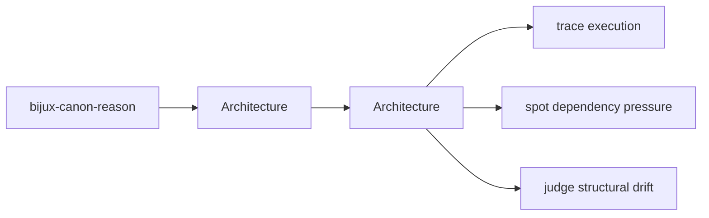
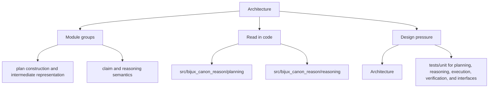

# Architecture

This section explains how `bijux_canon_reason` is organized so a reviewer can follow structure, dependency direction, and execution flow without guessing.

These pages turn `bijux-canon-reason` from a directory tree into a readable design map. Use them when a structural change needs to be grounded in named modules and real execution paths.

Treat the architecture pages for `bijux-canon-reason` as a reviewer-facing map of structure and flow. They should shorten code reading, not try to replace it.

## Page Maps

## Pages in This Section

- [Module Map](module-map.md)
- [Dependency Direction](dependency-direction.md)
- [Execution Model](execution-model.md)
- [State and Persistence](state-and-persistence.md)
- [Integration Seams](integration-seams.md)
- [Error Model](error-model.md)
- [Extensibility Model](extensibility-model.md)
- [Code Navigation](code-navigation.md)
- [Architecture Risks](architecture-risks.md)

## Read Across the Package

- [Foundation](../foundation/index.md) when you need the package boundary and ownership story first
- [Interfaces](../interfaces/index.md) when the question becomes caller-facing, schema-facing, or contract-facing
- [Operations](../operations/index.md) when the question becomes procedural, environmental, diagnostic, or release-oriented
- [Quality](../quality/index.md) when the question becomes proof, risk, trust, or review sufficiency

## Concrete Anchors

- `src/bijux_canon_reason/planning` for plan construction and intermediate representation
- `src/bijux_canon_reason/reasoning` for claim and reasoning semantics
- `src/bijux_canon_reason/execution` for step execution and tool dispatch

## Use This Page When

- you are tracing structure, execution flow, or dependency pressure
- you need to understand how modules fit before refactoring
- you are reviewing design drift rather than one isolated bug

## Decision Rule

Use `Architecture` to decide whether a structural change makes `bijux-canon-reason` easier or harder to explain in terms of modules, dependency direction, and execution flow. If the change works only because the design becomes harder to read, the safer answer is redesign rather than acceptance.

## What This Page Answers

- how `bijux-canon-reason` is organized internally in terms a reviewer can follow
- which modules carry the main execution and dependency story
- where structural drift would show up before it becomes expensive

## Reviewer Lens

- trace the described execution path through the named modules instead of trusting the diagram alone
- look for dependency direction or layering that now contradicts the documented seam
- verify that the structural risks named here still match the current code shape

## Honesty Boundary

This page describes the current structural model of `bijux-canon-reason`, but it does not guarantee that every import path or runtime path still obeys that model. Readers should treat it as a map that must stay aligned with code and tests, not as an authority above them.

## Next Checks

- move to interfaces when the review reaches a public or operator-facing seam
- move to operations when the concern becomes repeatable runtime behavior
- move to quality when you need proof that the documented structure is still protected

## Purpose

This page explains how to use the architecture section for `bijux-canon-reason` without repeating the detail that belongs on the topic pages beneath it.

## Stability

This page is part of the canonical package docs spine. Keep it aligned with the current package boundary and the topic pages in this section.
