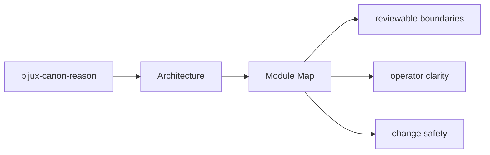
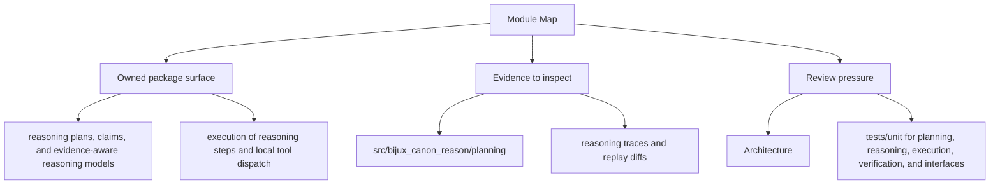

# Module Map

The architecture of `bijux-canon-reason` is easiest to understand from the major module groups.

Read the architecture pages for `bijux-canon-reason` as a reviewer-facing map of structure and flow: they should be detailed enough to shorten code reading without pretending to replace it.

## Page Maps

## Major Modules

- `src/bijux_canon_reason/planning` for plan construction and intermediate representation
- `src/bijux_canon_reason/reasoning` for claim and reasoning semantics
- `src/bijux_canon_reason/execution` for step execution and tool dispatch
- `src/bijux_canon_reason/verification` for checks and validation outcomes
- `src/bijux_canon_reason/traces` for trace replay and diff support
- `src/bijux_canon_reason/interfaces` for CLI and serialization boundaries

## Concrete Anchors

- `src/bijux_canon_reason/planning` for plan construction and intermediate representation
- `src/bijux_canon_reason/reasoning` for claim and reasoning semantics
- `src/bijux_canon_reason/execution` for step execution and tool dispatch

## Use This Page When

- you are tracing internal structure or execution flow
- you need to understand where modules fit before refactoring
- you are reviewing architectural drift instead of one local bug

## Decision Rule

Use `Module Map` to decide whether a structural change makes `bijux-canon-reason` easier or harder to explain in terms of modules, dependency direction, and execution flow. If the change only works because the architecture becomes less legible, the page should push the reviewer toward redesign rather than acceptance.

## Next Checks

- move to interfaces when the review reaches a public or operator-facing seam
- move to operations when the concern becomes repeatable runtime behavior
- move to quality when you need proof that the documented structure is still protected

## Update This Page When

- module responsibilities or dependency direction change materially
- new execution pathways or structural seams become important to review
- architectural risk shifts enough that the current map is misleading

## What This Page Answers

- how bijux-canon-reason is structured internally
- which modules control the main execution path
- where architectural drift would become visible first

## Reviewer Lens

- trace the claimed execution path through the listed modules
- look for dependency direction that now contradicts the documented seam
- verify that architectural risks still match the current code structure

## Honesty Boundary

This page describes the current structural model of bijux-canon-reason, but it does not by itself prove that every import or runtime path still obeys that model.

## Purpose

This page provides a shortest-path code map for the package.

## Stability

Keep it aligned with the actual source directories under `packages/bijux-canon-reason`.

## Core Claim

The architectural claim of `bijux-canon-reason` is that its structure is deliberate enough for a reviewer to trace responsibilities, dependencies, and drift pressure without reverse-engineering the entire codebase.

## Why It Matters

If the architecture pages for `bijux-canon-reason` are weak, refactors become guesswork and dependency drift can hide until failures show up in tests or production-facing behavior.

## If It Drifts

- dependency direction becomes harder to inspect quickly
- refactors can land without anyone noticing structural regressions until later
- code navigation becomes slower because the documented map no longer matches reality

## Representative Scenario

A reviewer is tracing a refactor through `bijux-canon-reason` and needs to know whether the changed modules still line up with the documented execution and dependency structure.

## Source Of Truth Order

- `packages/bijux-canon-reason/src/bijux_canon_reason` for the actual dependency and module structure
- `packages/bijux-canon-reason/tests` for structural and behavioral regressions
- this page for the reviewer-facing map that should remain aligned with those assets

## Common Misreadings

- that the documented module map guarantees every import is still clean automatically
- that one current implementation path is the whole architecture contract
- that diagrams replace the need to inspect the concrete modules listed here
