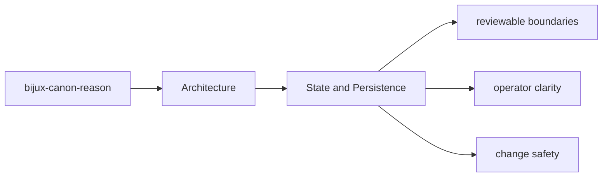
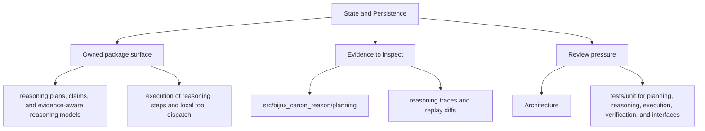

# State and Persistence

State in `bijux-canon-reason` should be explicit enough that a maintainer can say what is
transient, what is serialized, and what neighboring packages must not assume.

## Page Maps

## Durable Surfaces

- reasoning traces and replay diffs
- claim and verification outcomes
- evaluation suite artifacts

## Code Areas to Inspect

- `src/bijux_canon_reason/planning` for plan construction and intermediate representation
- `src/bijux_canon_reason/reasoning` for claim and reasoning semantics
- `src/bijux_canon_reason/execution` for step execution and tool dispatch
- `src/bijux_canon_reason/verification` for checks and validation outcomes
- `src/bijux_canon_reason/traces` for trace replay and diff support
- `src/bijux_canon_reason/interfaces` for CLI and serialization boundaries

## Use This Page When

- you are tracing internal structure or execution flow
- you need to understand where modules fit before refactoring
- you are reviewing architectural drift instead of one local bug

## What This Page Answers

- how bijux-canon-reason is structured internally
- which modules control the main execution path
- where architectural drift would become visible first

## Purpose

This page marks the package's state and artifact boundary.

## Stability

Keep it aligned with the actual artifact shapes and serialized outputs.
