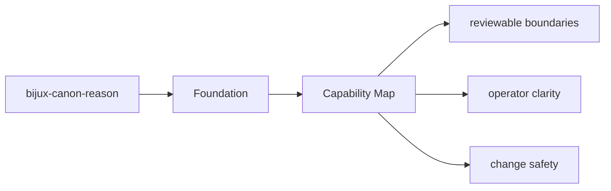
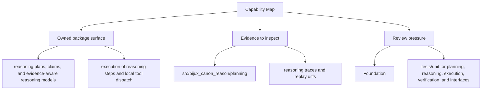

# Capability Map

The package capabilities can be read as a map from modules to behavior.

## Page Maps

## Capability Map

- `src/bijux_canon_reason/planning` for plan construction and intermediate representation
- `src/bijux_canon_reason/reasoning` for claim and reasoning semantics
- `src/bijux_canon_reason/execution` for step execution and tool dispatch
- `src/bijux_canon_reason/verification` for checks and validation outcomes
- `src/bijux_canon_reason/traces` for trace replay and diff support
- `src/bijux_canon_reason/interfaces` for CLI and serialization boundaries

## Produced Artifacts

- reasoning traces and replay diffs
- claim and verification outcomes
- evaluation suite artifacts

## Concrete Anchors

- `packages/bijux-canon-reason` as the package root
- `packages/bijux-canon-reason/src/bijux_canon_reason` as the import boundary
- `packages/bijux-canon-reason/tests` as the package proof surface

## Use This Page When

- you need the package boundary before reading implementation detail
- you are deciding whether work belongs in this package or a neighboring one
- you need the shortest stable description of package intent

## What This Page Answers

- what bijux-canon-reason is expected to own
- what remains outside the package boundary
- which neighboring seams a reviewer should compare next

## Reviewer Lens

- compare the stated package boundary with the owned modules and tests
- check that out-of-scope work is not quietly reintroduced through adjacent packages
- confirm that the package description still matches the real repository layout

## Honesty Boundary

This page can explain the intended boundary of bijux-canon-reason, but it does not replace the code and tests that ultimately prove that boundary.

## Purpose

This page helps a reader quickly map package claims to code areas.

## Stability

Keep it aligned with the real package modules and generated outputs.

## Core Claim

The foundational claim of `bijux-canon-reason` is that its package boundary can be explained in stable ownership terms instead of by implementation accident.

## Why It Matters

If the foundation pages for `bijux-canon-reason` are weak, reviewers stop knowing where the package boundary really is and adjacent packages begin absorbing behavior by convenience instead of design.

## If It Drifts

- ownership starts migrating by convenience instead of by explicit package boundary
- neighboring packages inherit responsibilities without deliberate review
- reviewers lose confidence that the package description still means anything stable

## Representative Scenario

A contributor proposes moving new behavior into `bijux-canon-reason` because it is nearby in the repository. This page should make it obvious whether that work fits the package boundary or belongs in a neighboring package instead.
