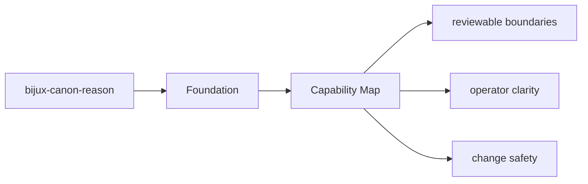

# Capability Map

The package capabilities can be read as a map from modules to behavior.

## Page Maps

## Capability Map

- `src/bijux_canon_reason/planning` for plan construction and intermediate representation
- `src/bijux_canon_reason/reasoning` for claim and reasoning semantics
- `src/bijux_canon_reason/execution` for step execution and tool dispatch
- `src/bijux_canon_reason/verification` for checks and validation outcomes
- `src/bijux_canon_reason/traces` for trace replay and diff support
- `src/bijux_canon_reason/interfaces` for CLI and serialization boundaries

## Produced Artifacts

- reasoning traces and replay diffs
- claim and verification outcomes
- evaluation suite artifacts

## Purpose

This page helps a reader quickly map package claims to code areas.

## Stability

Keep it aligned with the real package modules and generated outputs.
