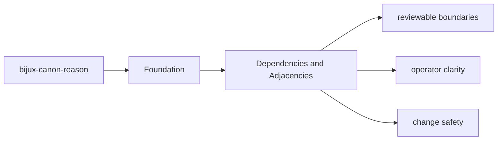
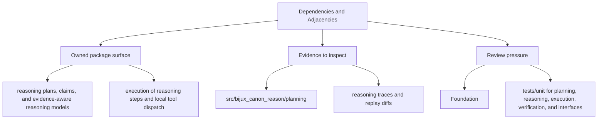

# Dependencies and Adjacencies

Package dependencies matter because they reveal which behavior is local and which behavior is delegated.

## Page Maps

## Direct Dependency Themes

- pydantic
- typer
- fastapi

## Adjacent Package Relationships

- consumes evidence prepared by ingest and retrieval provided by index
- relies on runtime when a run must be accepted, stored, or replayed under policy

## What This Page Answers

- what bijux-canon-reason is expected to own
- what remains outside the package boundary
- which neighboring seams a reviewer should compare next

## Purpose

This page explains which surrounding tools and packages `bijux-canon-reason` depends on to do its job.

## Stability

Keep it aligned with `pyproject.toml` and the actual package seams.
