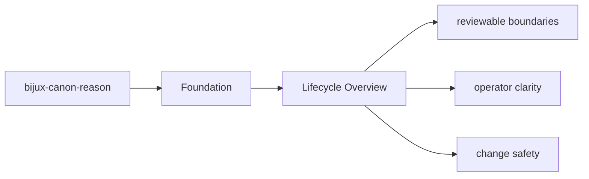
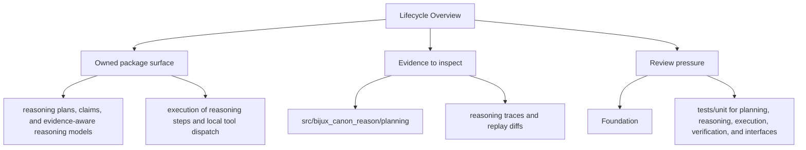

# Lifecycle Overview

Every package run follows a simple lifecycle: inputs enter through interfaces, domain and
application code coordinate the work, and durable artifacts or responses leave the package.

## Page Maps

## Lifecycle Anchors

- entry surfaces: CLI app in src/bijux_canon_reason/interfaces/cli, HTTP app in src/bijux_canon_reason/api/v1, schema files in apis/bijux-canon-reason/v1
- code ownership: src/bijux_canon_reason/planning, src/bijux_canon_reason/reasoning, src/bijux_canon_reason/execution
- durable outputs: reasoning traces and replay diffs, claim and verification outcomes, evaluation suite artifacts

## Use This Page When

- you need the package boundary before reading implementation detail
- you are deciding whether work belongs in this package or a neighboring one
- you need the shortest stable description of package intent

## What This Page Answers

- what bijux-canon-reason is expected to own
- what remains outside the package boundary
- which neighboring seams a reviewer should compare next

## Purpose

This page keeps the package lifecycle readable before a reader dives into implementation detail.

## Stability

Keep it aligned with the current entrypoints and produced outputs.
