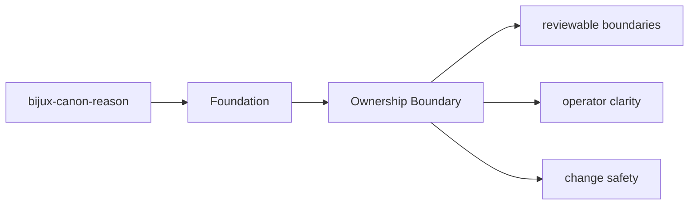
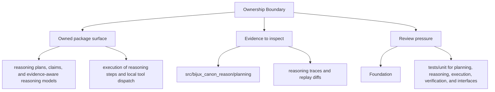

# Ownership Boundary

Ownership in `bijux-canon-reason` is easiest to read from the source tree plus the tests that protect it.

## Page Maps

## Owned Code Areas

- `src/bijux_canon_reason/planning` for plan construction and intermediate representation
- `src/bijux_canon_reason/reasoning` for claim and reasoning semantics
- `src/bijux_canon_reason/execution` for step execution and tool dispatch
- `src/bijux_canon_reason/verification` for checks and validation outcomes
- `src/bijux_canon_reason/traces` for trace replay and diff support
- `src/bijux_canon_reason/interfaces` for CLI and serialization boundaries

## Adjacent Systems

- consumes evidence prepared by ingest and retrieval provided by index
- relies on runtime when a run must be accepted, stored, or replayed under policy

## Use This Page When

- you need the package boundary before reading implementation detail
- you are deciding whether work belongs in this package or a neighboring one
- you need the shortest stable description of package intent

## What This Page Answers

- what bijux-canon-reason is expected to own
- what remains outside the package boundary
- which neighboring seams a reviewer should compare next

## Purpose

This page ties package ownership to concrete directories instead of abstract slogans.

## Stability

Keep it aligned with the current module layout.
