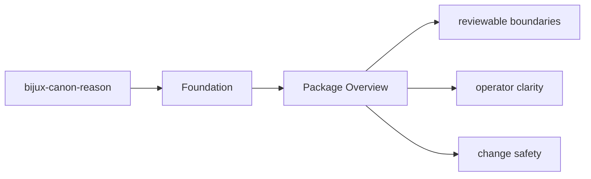

# Package Overview

`bijux-canon-reason` is the package that owns deterministic evidence-aware reasoning, claim formation, verification, and traceable reasoning workflows.

## Page Maps

## What It Owns

- reasoning plans, claims, and evidence-aware reasoning models
- execution of reasoning steps and local tool dispatch
- verification and provenance checks that belong to reasoning itself
- package-local CLI and API boundaries

## What It Does Not Own

- runtime persistence and replay authority
- ingest and index engines
- repository tooling and release automation

## Purpose

This page gives the shortest honest description of what the package is for.

## Stability

Keep it aligned with the real package boundary described by the code and tests.
