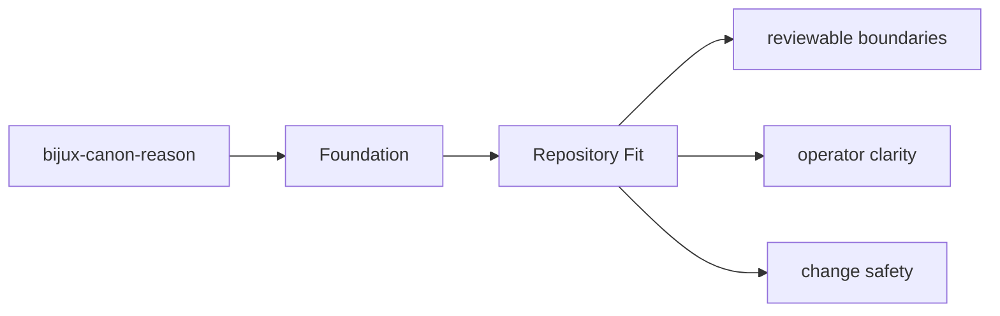
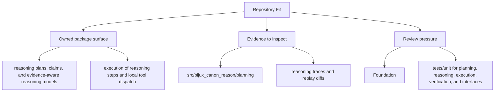

# Repository Fit

`bijux-canon-reason` is one publishable part of a larger system. It sits in the
monorepo with its own `src/`, tests, metadata, and release history because the
repository wants package ownership to stay visible even when the packages evolve
together.

This page is here to answer a simple but important question: why is this work a
package at all, instead of just another folder inside a single giant project?

Read the foundation pages for `bijux-canon-reason` as the package's durable self-description. They should let a reader understand the package without needing to reconstruct its purpose from recent implementation history.

## Page Maps

## Repository Relationships

- consumes evidence prepared by ingest and retrieval provided by index
- relies on runtime when a run must be accepted, stored, or replayed under policy

## Canonical Package Root

- `packages/bijux-canon-reason`
- `packages/bijux-canon-reason/src/bijux_canon_reason`
- `packages/bijux-canon-reason/tests`

## Concrete Anchors

- `packages/bijux-canon-reason` as the package root
- `packages/bijux-canon-reason/src/bijux_canon_reason` as the import boundary
- `packages/bijux-canon-reason/tests` as the package proof surface

## Use This Page When

- you need the package idea before the implementation detail
- you are deciding whether work belongs here or in a neighboring package
- you want the shortest honest explanation of what this package is for

## Decision Rule

Use `Repository Fit` to decide whether a change makes `bijux-canon-reason` easier or harder to defend as a bounded package. If the work expands package authority without making ownership clearer, stop and re-check the boundary before treating the change as a local improvement.

## Next Checks

- move to architecture when the question becomes structural rather than boundary-oriented
- move to interfaces when the question becomes contract-facing
- move to quality when the question becomes proof or review sufficiency

## Update This Page When

- package ownership moves between this package and a neighboring one
- the package description, core outputs, or boundary modules materially change
- tests or docs reveal that the old boundary explanation is no longer accurate

## What This Page Answers

- what problem `bijux-canon-reason` is supposed to own on purpose
- where the package boundary stops, even when nearby code looks tempting
- which neighboring package seams deserve comparison before the boundary is changed

## Reviewer Lens

- compare the stated boundary with the modules, artifacts, and tests that are supposed to uphold it
- check that out-of-scope behavior is not quietly re-entering through convenience paths
- confirm that the package story still matches the real repository layout and neighboring package docs

## Honesty Boundary

This page can explain the intended boundary of bijux-canon-reason, but it does not replace the code and tests that ultimately prove that boundary.

## Purpose

This page explains how the package fits into the repository without restating repository-wide rules.

## Stability

Keep it aligned with the package's checked-in directories and actual neighboring packages.

## What Good Looks Like

- `Repository Fit` leaves a reviewer able to explain `bijux-canon-reason` in one boundary sentence without hand-waving
- the owned and out-of-scope areas read as complementary rather than contradictory
- neighboring packages become easier to place because this package is clearly bounded

## Failure Signals

- `Repository Fit` has to explain the same ownership claim with repeated exceptions
- the out-of-scope list starts looking like shadow ownership instead of a real boundary
- review conversations keep falling back to package adjacency rather than package intent

## Tradeoffs To Hold

- prefer clean ownership over local convenience, even when a nearby package looks easier to reuse
- prefer an explicit boundary gap over a shadow responsibility that no package clearly owns
- prefer keeping `bijux-canon-reason` intelligible as a bounded package over making it look universally useful

## Cross Implications

- changes here influence how neighboring packages are allowed to stay narrow around `bijux-canon-reason`
- a weak boundary explanation raises architectural and quality ambiguity immediately
- interface and operations pages inherit confusion when foundational ownership is unclear

## Approval Questions

- does `Repository Fit` still let a reviewer state `bijux-canon-reason` ownership in one clear sentence
- does the change preserve package boundaries without creating shadow scope in a neighbor
- is there concrete code and test evidence behind the boundary claim rather than prose alone

## Evidence Checklist

- read the owned module roots under `packages/bijux-canon-reason/src/bijux_canon_reason` with the boundary statement in mind
- inspect `packages/bijux-canon-reason/tests` for proof that the boundary is enforced instead of merely described
- check whether adjacent package docs now tell a conflicting ownership story

## Anti-Patterns

- using package adjacency as a substitute for package ownership
- letting boundary exceptions accumulate until they become the real rule
- writing boundary prose that cannot be checked against code or tests

## Escalate When

- the page can no longer explain ownership without repeated cross-package caveats
- a change proposal would shift authority between packages rather than stay local
- tests and docs disagree on who is supposed to own the behavior

## Core Claim

The foundational claim of `bijux-canon-reason` is that its package boundary can be explained in stable ownership terms instead of by implementation accident.

## Why It Matters

If the foundation pages for `bijux-canon-reason` are weak, reviewers stop knowing where the package boundary really is and adjacent packages begin absorbing behavior by convenience instead of design.

## If It Drifts

- ownership starts migrating by convenience instead of by explicit package boundary
- neighboring packages inherit responsibilities without deliberate review
- reviewers lose confidence that the package description still means anything stable

## Representative Scenario

A contributor proposes moving new behavior into `bijux-canon-reason` because it is nearby in the repository. This page should make it obvious whether that work fits the package boundary or belongs in a neighboring package instead.

## Source Of Truth Order

- `packages/bijux-canon-reason/src/bijux_canon_reason` for the real ownership boundary in code
- `packages/bijux-canon-reason/tests` for executable proof of that boundary
- `packages/bijux-canon-reason/README.md` and this section for the shortest maintained framing

## Common Misreadings

- that `bijux-canon-reason` owns any nearby behavior just because it is convenient
- that a boundary statement is enough without the code and tests that enforce it
- that out-of-scope means unimportant rather than owned elsewhere
