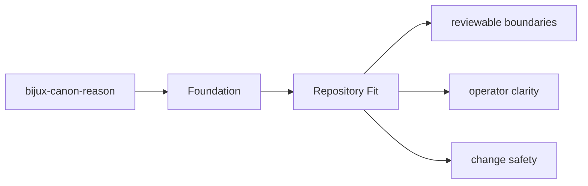

# Repository Fit

`bijux-canon-reason` sits inside the monorepo as one publishable package with its own `src/`,
tests, metadata, and release history.

## Page Maps

## Repository Relationships

- consumes evidence prepared by ingest and retrieval provided by index
- relies on runtime when a run must be accepted, stored, or replayed under policy

## Canonical Package Root

- `packages/bijux-canon-reason`
- `packages/bijux-canon-reason/src/bijux_canon_reason`
- `packages/bijux-canon-reason/tests`

## Purpose

This page explains how the package fits into the repository without restating repository-wide rules.

## Stability

Keep it aligned with the package's checked-in directories and actual neighboring packages.
