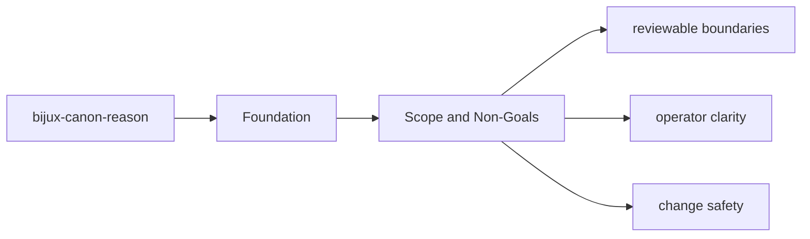
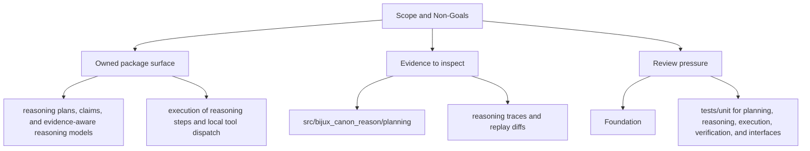

# Scope and Non-Goals

The package boundary exists so neighboring packages can evolve without hidden overlap.

## Page Maps

## In Scope

- reasoning plans, claims, and evidence-aware reasoning models
- execution of reasoning steps and local tool dispatch
- verification and provenance checks that belong to reasoning itself
- package-local CLI and API boundaries

## Out of Scope

- runtime persistence and replay authority
- ingest and index engines
- repository tooling and release automation

## Concrete Anchors

- `packages/bijux-canon-reason` as the package root
- `packages/bijux-canon-reason/src/bijux_canon_reason` as the import boundary
- `packages/bijux-canon-reason/tests` as the package proof surface

## Use This Page When

- you need the package boundary before reading implementation detail
- you are deciding whether work belongs in this package or a neighboring one
- you need the shortest stable description of package intent

## What This Page Answers

- what bijux-canon-reason is expected to own
- what remains outside the package boundary
- which neighboring seams a reviewer should compare next

## Reviewer Lens

- compare the stated package boundary with the owned modules and tests
- check that out-of-scope work is not quietly reintroduced through adjacent packages
- confirm that the package description still matches the real repository layout

## Honesty Boundary

This page can explain the intended boundary of bijux-canon-reason, but it does not replace the code and tests that ultimately prove that boundary.

## Purpose

This page keeps future work from leaking into the wrong package.

## Stability

Update it only when ownership truly moves into or out of `bijux-canon-reason`.
