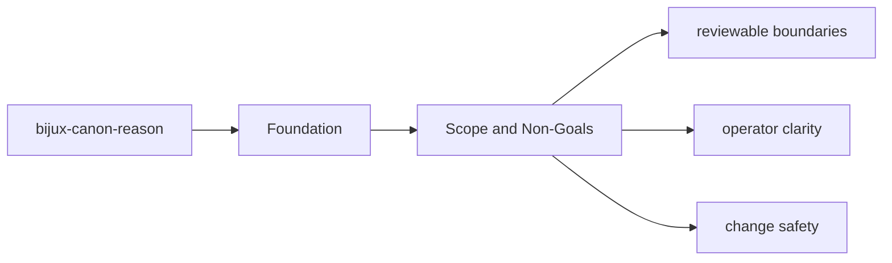

# Scope and Non-Goals

The package boundary exists so neighboring packages can evolve without hidden overlap.

## Page Maps

## In Scope

- reasoning plans, claims, and evidence-aware reasoning models
- execution of reasoning steps and local tool dispatch
- verification and provenance checks that belong to reasoning itself
- package-local CLI and API boundaries

## Out of Scope

- runtime persistence and replay authority
- ingest and index engines
- repository tooling and release automation

## Purpose

This page keeps future work from leaking into the wrong package.

## Stability

Update it only when ownership truly moves into or out of `bijux-canon-reason`.
