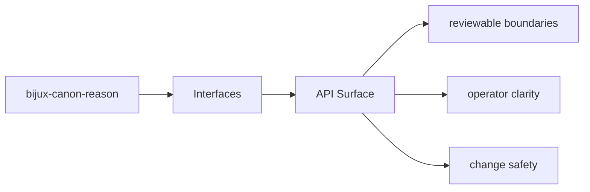

# API Surface

HTTP-facing behavior should be discoverable from tracked schema files and the owning API modules.

## Page Maps

## API Artifacts

- apis/bijux-canon-reason/v1/schema.yaml
- apis/bijux-canon-reason/v1/pinned_openapi.json

## Boundary Modules

- CLI app in src/bijux_canon_reason/interfaces/cli
- HTTP app in src/bijux_canon_reason/api/v1
- schema files in apis/bijux-canon-reason/v1

## Purpose

This page ties API behavior to tracked code and schema assets.

## Stability

Keep it aligned with the actual API modules and schema files.
