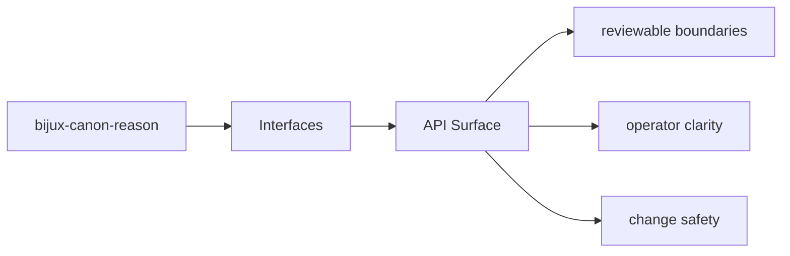
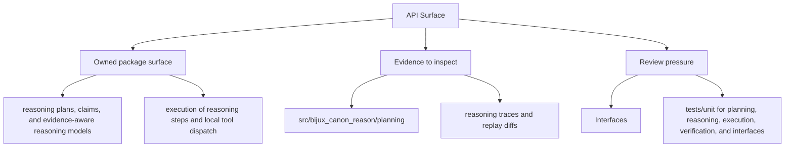

# API Surface

HTTP-facing behavior should be discoverable from tracked schema files and the owning API modules.

## Page Maps

## API Artifacts

- apis/bijux-canon-reason/v1/schema.yaml
- apis/bijux-canon-reason/v1/pinned_openapi.json

## Boundary Modules

- CLI app in src/bijux_canon_reason/interfaces/cli
- HTTP app in src/bijux_canon_reason/api/v1
- schema files in apis/bijux-canon-reason/v1

## Concrete Anchors

- CLI app in src/bijux_canon_reason/interfaces/cli
- HTTP app in src/bijux_canon_reason/api/v1
- schema files in apis/bijux-canon-reason/v1
- apis/bijux-canon-reason/v1/schema.yaml

## Use This Page When

- you need the public command, API, import, or artifact surface
- you are checking whether a caller can rely on a given shape or entrypoint
- you need the contract-facing side of the package before using it

## What This Page Answers

- which public or operator-facing surfaces bijux-canon-reason exposes
- which artifacts and schemas act like contracts
- what compatibility pressure this surface creates

## Reviewer Lens

- compare commands, API files, imports, and artifacts against the documented surface
- check whether schema or artifact changes need compatibility review
- confirm that operator-facing examples still point at real entrypoints

## Honesty Boundary

This page can identify the intended public surfaces of bijux-canon-reason, but real compatibility still depends on code, schemas, artifacts, and tests staying aligned.

## Purpose

This page ties API behavior to tracked code and schema assets.

## Stability

Keep it aligned with the actual API modules and schema files.

## Core Claim

The interface claim of `bijux-canon-reason` is that commands, APIs, imports, schemas, and artifacts form a reviewable contract rather than an implied one.

## Why It Matters

If the interface pages for `bijux-canon-reason` are weak, callers cannot tell which commands, schemas, or artifacts are stable enough to depend on, and compatibility review arrives too late.

## If It Drifts

- callers depend on surfaces that are less stable than the docs imply
- schema and artifact changes stop receiving the compatibility review they need
- operator examples begin pointing at stale or misleading entrypaths
