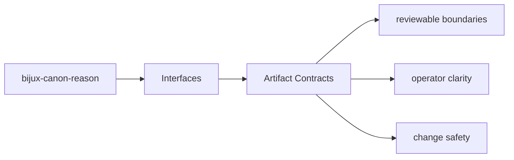
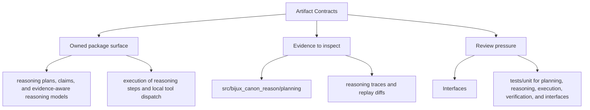

# Artifact Contracts

Produced artifacts are part of the package contract whenever another package, operator,
or replay workflow depends on them.

## Page Maps

## Current Artifacts

- reasoning traces and replay diffs
- claim and verification outcomes
- evaluation suite artifacts

## Concrete Anchors

- CLI app in src/bijux_canon_reason/interfaces/cli
- HTTP app in src/bijux_canon_reason/api/v1
- schema files in apis/bijux-canon-reason/v1
- apis/bijux-canon-reason/v1/schema.yaml

## Use This Page When

- you need the public command, API, import, or artifact surface
- you are checking whether a caller can rely on a given shape or entrypoint
- you need the contract-facing side of the package before using it

## Next Checks

- move to operations when the caller-facing question becomes procedural or environmental
- move to quality when compatibility or evidence of protection becomes the real issue
- move back to architecture when a public-surface question reveals a deeper structural drift

## Update This Page When

- commands, schemas, API modules, imports, or artifacts change in a caller-visible way
- compatibility expectations change or a new contract surface appears
- examples or entrypoints stop matching the actual package boundary

## What This Page Answers

- which public or operator-facing surfaces bijux-canon-reason exposes
- which artifacts and schemas act like contracts
- what compatibility pressure this surface creates

## Reviewer Lens

- compare commands, API files, imports, and artifacts against the documented surface
- check whether schema or artifact changes need compatibility review
- confirm that operator-facing examples still point at real entrypoints

## Honesty Boundary

This page can identify the intended public surfaces of bijux-canon-reason, but real compatibility still depends on code, schemas, artifacts, and tests staying aligned.

## Purpose

This page marks which outputs need stable review when behavior changes.

## Stability

Keep it aligned with the package outputs that are actually produced and consumed.

## Core Claim

The interface claim of `bijux-canon-reason` is that commands, APIs, imports, schemas, and artifacts form a reviewable contract rather than an implied one.

## Why It Matters

If the interface pages for `bijux-canon-reason` are weak, callers cannot tell which commands, schemas, or artifacts are stable enough to depend on, and compatibility review arrives too late.

## If It Drifts

- callers depend on surfaces that are less stable than the docs imply
- schema and artifact changes stop receiving the compatibility review they need
- operator examples begin pointing at stale or misleading entrypaths

## Representative Scenario

An operator or downstream caller wants to depend on a `bijux-canon-reason` surface and needs to know which command, API, schema, import, or artifact is stable enough to treat as a contract.

## Source Of Truth Order

- `packages/bijux-canon-reason/src/bijux_canon_reason` for the implemented boundary
- `apis/bijux-canon-reason/v1/schema.yaml` as tracked contract evidence
- `packages/bijux-canon-reason/tests` for compatibility and behavior proof

## Common Misreadings

- that every visible package surface is equally stable
- that one schema or example is the whole compatibility story
- that interface docs override package code, artifacts, or tests when they disagree
