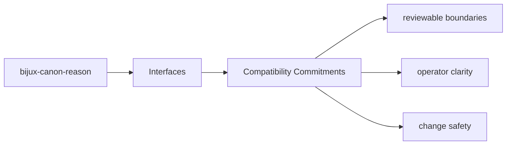
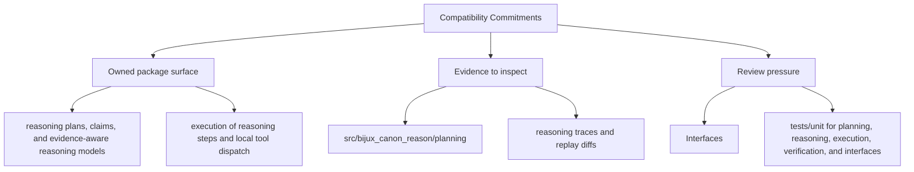

# Compatibility Commitments

Compatibility in `bijux-canon-reason` should be explicit: stable commands, tracked schemas,
durable artifacts, and release notes that explain intentional breakage.

## Page Maps

## Compatibility Anchors

- README.md
- CHANGELOG.md
- pyproject.toml

## Review Rule

Breaking changes must be visible in code, docs, and validation together.

## Purpose

This page describes what should trigger compatibility review for the package.

## Stability

Keep it aligned with the package's actual public surfaces and release process.
