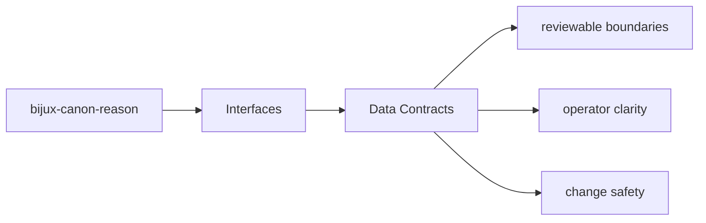
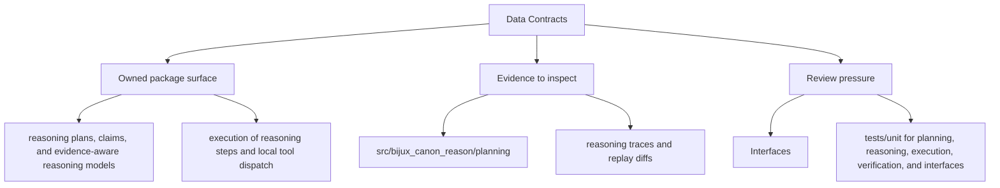

# Data Contracts

Data contracts in `bijux-canon-reason` include schemas, structured models, and any stable
payload shape that neighboring systems are expected to understand.

Read the interfaces pages for `bijux-canon-reason` as the bridge between implementation and caller expectations: they should make public surfaces legible before a downstream dependency is formed.

## Page Maps

## Contract Anchors

- apis/bijux-canon-reason/v1/schema.yaml
- apis/bijux-canon-reason/v1/pinned_openapi.json

## Artifact Anchors

- reasoning traces and replay diffs
- claim and verification outcomes
- evaluation suite artifacts

## Concrete Anchors

- CLI app in src/bijux_canon_reason/interfaces/cli
- HTTP app in src/bijux_canon_reason/api/v1
- schema files in apis/bijux-canon-reason/v1
- apis/bijux-canon-reason/v1/schema.yaml

## Use This Page When

- you need the public command, API, import, or artifact surface
- you are checking whether a caller can rely on a given shape or entrypoint
- you need the contract-facing side of the package before using it

## Decision Rule

Use `Data Contracts` to decide whether a caller-facing surface is explicit enough to be depended on. If the surface cannot be tied back to concrete code, schemas, artifacts, and tests, it should be treated as unstable until that evidence exists.

## Next Checks

- move to operations when the caller-facing question becomes procedural or environmental
- move to quality when compatibility or evidence of protection becomes the real issue
- move back to architecture when a public-surface question reveals a deeper structural drift

## Update This Page When

- commands, schemas, API modules, imports, or artifacts change in a caller-visible way
- compatibility expectations change or a new contract surface appears
- examples or entrypoints stop matching the actual package boundary

## What This Page Answers

- which public or operator-facing surfaces bijux-canon-reason exposes
- which artifacts and schemas act like contracts
- what compatibility pressure this surface creates

## Reviewer Lens

- compare commands, API files, imports, and artifacts against the documented surface
- check whether schema or artifact changes need compatibility review
- confirm that operator-facing examples still point at real entrypoints

## Honesty Boundary

This page can identify the intended public surfaces of bijux-canon-reason, but real compatibility still depends on code, schemas, artifacts, and tests staying aligned.

## Purpose

This page explains which structured shapes deserve compatibility review.

## Stability

Keep it aligned with tracked schemas, stable models, and durable artifacts.

## What Good Looks Like

- `Data Contracts` leaves a caller knowing which surfaces are explicit enough to trust
- the contract discussion ties together commands, schemas, artifacts, and tests instead of treating them separately
- compatibility review becomes a visible step rather than an afterthought

## Failure Signals

- `Data Contracts` names surfaces that cannot be matched to real code, schemas, or artifacts
- callers have to infer stability from examples instead of from explicit contract evidence
- compatibility review starts after change has already landed instead of before

## Tradeoffs To Hold

- prefer a smaller explicit contract over a wider surface whose stability has to be guessed
- prefer paying compatibility-review cost up front over discovering caller breakage after release
- prefer contract evidence that is slightly heavier to maintain over allowing `bijux-canon-reason` surfaces to drift silently

## Cross Implications

- changes here shape what downstream packages and operators can safely assume about `bijux-canon-reason`
- operations and quality pages become stale quickly if contract surfaces move silently
- architectural seams need review whenever a new public surface appears for convenience

## Approval Questions

- does `Data Contracts` name only caller-facing surfaces that have explicit contract evidence
- would a downstream consumer understand compatibility expectations before depending on the surface
- are code, schemas, artifacts, examples, and tests still telling the same contract story

## Evidence Checklist

- inspect the implemented interface modules under `packages/bijux-canon-reason/src/bijux_canon_reason`
- review `apis/bijux-canon-reason/v1/schema.yaml` as tracked contract evidence
- run through `packages/bijux-canon-reason/tests` or equivalent proofs that protect the surface

## Anti-Patterns

- treating convenience surfaces as if they were deliberate contracts
- changing schemas or artifacts without a caller-facing compatibility discussion
- using examples to imply stability that code and tests do not actually promise

## Escalate When

- a supposedly local change alters a caller-visible schema, artifact, import, or command contract
- compatibility risk extends beyond one implementation file
- operators or downstream packages would need to relearn the surface after the change

## Core Claim

The interface claim of `bijux-canon-reason` is that commands, APIs, imports, schemas, and artifacts form a reviewable contract rather than an implied one.

## Why It Matters

If the interface pages for `bijux-canon-reason` are weak, callers cannot tell which commands, schemas, or artifacts are stable enough to depend on, and compatibility review arrives too late.

## If It Drifts

- callers depend on surfaces that are less stable than the docs imply
- schema and artifact changes stop receiving the compatibility review they need
- operator examples begin pointing at stale or misleading entrypaths

## Representative Scenario

An operator or downstream caller wants to depend on a `bijux-canon-reason` surface and needs to know which command, API, schema, import, or artifact is stable enough to treat as a contract.

## Source Of Truth Order

- `packages/bijux-canon-reason/src/bijux_canon_reason` for the implemented boundary
- `apis/bijux-canon-reason/v1/schema.yaml` as tracked contract evidence
- `packages/bijux-canon-reason/tests` for compatibility and behavior proof

## Common Misreadings

- that every visible package surface is equally stable
- that one schema or example is the whole compatibility story
- that interface docs override package code, artifacts, or tests when they disagree
