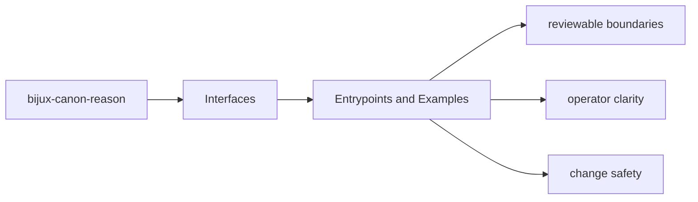
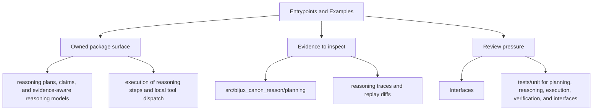

# Entrypoints and Examples

The fastest way to understand the package interfaces is to pair entrypoints with concrete examples.

## Page Maps

## Entrypoints

- CLI app in src/bijux_canon_reason/interfaces/cli
- HTTP app in src/bijux_canon_reason/api/v1
- schema files in apis/bijux-canon-reason/v1

## Example Anchors

- tooling/evaluation_suites for controlled reasoning suites
- tests/e2e as executable operator examples

## Purpose

This page records where maintainers can find real invocation examples instead of inventing them from scratch.

## Stability

Keep it aligned with the checked-in examples, fixtures, and executable tests.
