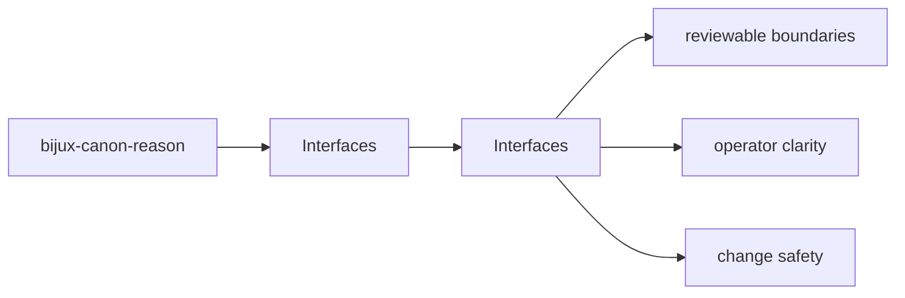

# Interfaces

bijux-canon-reason interface pages describe the command, API, configuration, import, and artifact surfaces that a caller can rely on.

## Page Maps

## Pages in This Section

- [CLI Surface](cli-surface.md)
- [API Surface](api-surface.md)
- [Configuration Surface](configuration-surface.md)
- [Data Contracts](data-contracts.md)
- [Artifact Contracts](artifact-contracts.md)
- [Entrypoints and Examples](entrypoints-and-examples.md)
- [Operator Workflows](operator-workflows.md)
- [Public Imports](public-imports.md)
- [Compatibility Commitments](compatibility-commitments.md)

## Read Across the Package

- [Foundation](../foundation/index.md)
- [Architecture](../architecture/index.md)
- [Operations](../operations/index.md)
- [Quality](../quality/index.md)

## Purpose

This page explains how to use the interfaces section for `bijux-canon-reason` without repeating the detail that belongs on the topic pages beneath it.

## Stability

This page is part of the canonical package docs spine. Keep it aligned with the current package boundary and the topic pages in this section.
