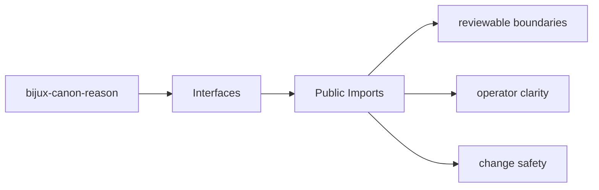
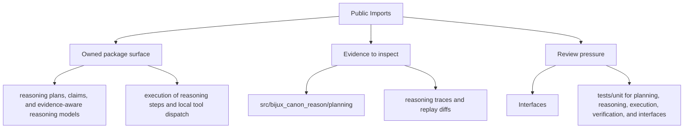

# Public Imports

The public Python surface of `bijux-canon-reason` starts at the package import root and any
intentionally exported modules beneath it.

## Page Maps

## Import Anchor

- import root: `bijux_canon_reason`
- package source root: `packages/bijux-canon-reason/src/bijux_canon_reason`

## What This Page Answers

- which public or operator-facing surfaces bijux-canon-reason exposes
- which artifacts and schemas act like contracts
- what compatibility pressure this surface creates

## Purpose

This page keeps the import-facing contract visible when refactoring package internals.

## Stability

Keep it aligned with the actual package source tree and documented import paths.
