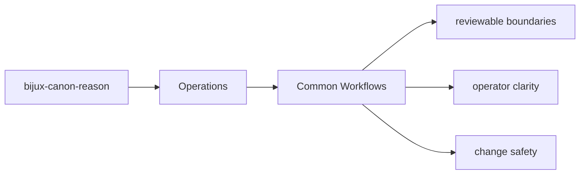

# Common Workflows

Most work on `bijux-canon-reason` follows one of a few recurring paths.

## Page Maps

## Recurring Paths

- inspect the package README and section indexes first
- follow an interface into the owning module group
- run the owning tests before declaring the change complete

## Code Areas

- `src/bijux_canon_reason/planning` for plan construction and intermediate representation
- `src/bijux_canon_reason/reasoning` for claim and reasoning semantics
- `src/bijux_canon_reason/execution` for step execution and tool dispatch
- `src/bijux_canon_reason/verification` for checks and validation outcomes
- `src/bijux_canon_reason/traces` for trace replay and diff support
- `src/bijux_canon_reason/interfaces` for CLI and serialization boundaries

## Purpose

This page makes common package workflows easier to repeat consistently.

## Stability

Keep it aligned with the actual package structure and tests.
