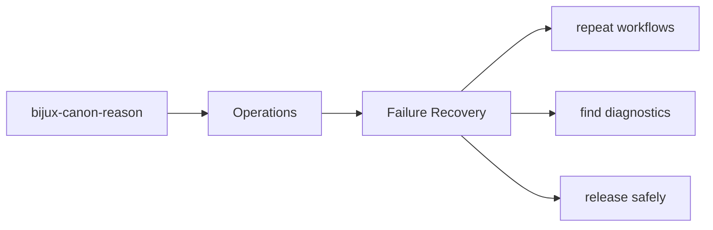
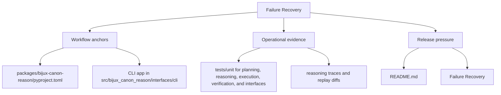

# Failure Recovery

Failure recovery starts with knowing which artifacts, interfaces, and tests expose the problem.

This page should help a maintainer stabilize the situation before they try to
improve it. The first question is not always how to fix the bug; it is how to
locate the right evidence quickly.

Read the operations pages for `bijux-canon-reason` as the package's explicit operating memory. They should make common tasks repeatable without forcing maintainers to relearn the workflow from code, CI logs, or oral history.

## Page Maps

## Recovery Anchors

- interface surfaces: CLI app in src/bijux_canon_reason/interfaces/cli, HTTP app in src/bijux_canon_reason/api/v1, schema files in apis/bijux-canon-reason/v1
- artifacts to inspect: reasoning traces and replay diffs, claim and verification outcomes, evaluation suite artifacts
- tests to run: tests/unit for planning, reasoning, execution, verification, and interfaces, tests/e2e for API, CLI, replay gates, retrieval reasoning, and smoke coverage

## Concrete Anchors

- `packages/bijux-canon-reason/pyproject.toml` for package metadata
- `packages/bijux-canon-reason/README.md` for local package framing
- `packages/bijux-canon-reason/tests` for executable operational backstops

## Use This Page When

- you are installing, running, diagnosing, or releasing the package
- you need repeatable operational anchors rather than architectural framing
- you are responding to package behavior in local work, CI, or incident pressure

## Decision Rule

Use `Failure Recovery` to decide whether a maintainer can repeat the package workflow from checked-in assets instead of memory. If a step works only because someone already knows the trick, the workflow is not documented clearly enough yet.

## What This Page Answers

- how `bijux-canon-reason` is installed, run, diagnosed, and released in practice
- which checked-in files and tests anchor the operational story
- where a maintainer should look first when the package behaves differently

## Reviewer Lens

- verify that setup, workflow, and release statements still match package metadata and current commands
- check that operational guidance still points at real diagnostics and validation paths
- confirm that maintainer advice still works under current local and CI expectations

## Honesty Boundary

This page explains how `bijux-canon-reason` is expected to be operated, but it does not replace package metadata, actual runtime behavior, or validation in a real environment. A workflow is only trustworthy if a maintainer can still repeat it from the checked-in assets named here.

## Next Checks

- move to interfaces when the operational path depends on a specific surface contract
- move to quality when the question becomes whether the workflow is sufficiently proven
- move back to architecture when operational complexity suggests a structural problem

## Purpose

This page gives maintainers a durable frame for triaging package failures.

## Stability

Keep it aligned with the package entrypoints and diagnostic outputs.
