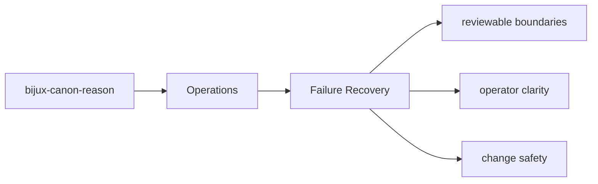
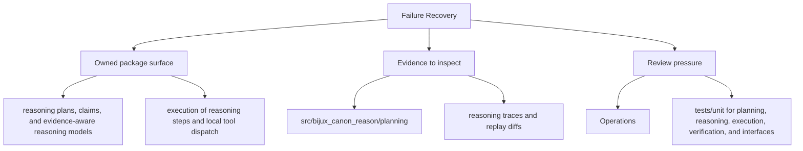

# Failure Recovery

Failure recovery starts with knowing which artifacts, interfaces, and tests expose the problem.

## Page Maps

## Recovery Anchors

- interface surfaces: CLI app in src/bijux_canon_reason/interfaces/cli, HTTP app in src/bijux_canon_reason/api/v1, schema files in apis/bijux-canon-reason/v1
- artifacts to inspect: reasoning traces and replay diffs, claim and verification outcomes, evaluation suite artifacts
- tests to run: tests/unit for planning, reasoning, execution, verification, and interfaces, tests/e2e for API, CLI, replay gates, retrieval reasoning, and smoke coverage

## Concrete Anchors

- `packages/bijux-canon-reason/pyproject.toml` for package metadata
- `packages/bijux-canon-reason/README.md` for local package framing
- `packages/bijux-canon-reason/tests` for executable operational backstops

## Use This Page When

- you are installing, running, diagnosing, or releasing the package
- you need operational anchors rather than conceptual framing
- you are responding to package behavior in a local or CI environment

## What This Page Answers

- how bijux-canon-reason is installed, run, diagnosed, and released
- which files or tests matter during package operation
- where an operator should look when behavior changes

## Reviewer Lens

- verify that setup, workflow, and release references still match package metadata
- check that operational docs point at current diagnostics and validation paths
- confirm that release-facing claims match the package's actual versioning files

## Honesty Boundary

This page explains how bijux-canon-reason is expected to be operated, but it does not replace package metadata, runtime behavior, or validation runs in a real environment.

## Purpose

This page gives maintainers a durable frame for triaging package failures.

## Stability

Keep it aligned with the package entrypoints and diagnostic outputs.
