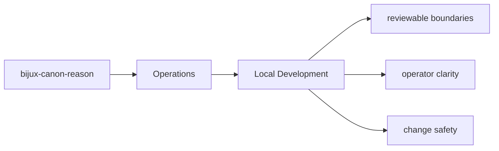

# Local Development

Local development should happen inside `packages/bijux-canon-reason` with tests and docs updated
in the same change series as the code.

## Page Maps

## Development Anchors

- tests/unit for planning, reasoning, execution, verification, and interfaces
- tests/e2e for API, CLI, replay gates, retrieval reasoning, and smoke coverage
- tests/perf for retrieval benchmark coverage
- tests/docs for documentation-linked safeguards

## Purpose

This page records the package-local development posture.

## Stability

Keep it aligned with the actual test layout and maintenance workflow.
