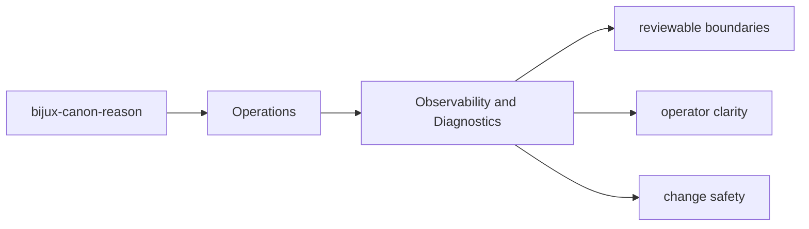
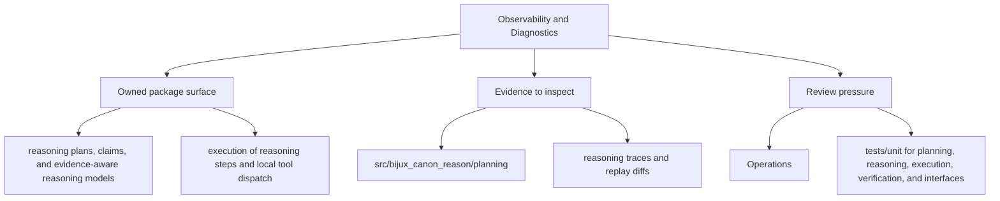

# Observability and Diagnostics

Diagnostics should make it easier to explain what `bijux-canon-reason` did, not merely that it ran.

Good diagnostics shorten both incidents and reviews. They give maintainers a
way to connect visible outputs back to the package behavior that produced them.

Read the operations pages for `bijux-canon-reason` as the package's explicit operating memory. They should make common tasks repeatable without forcing maintainers to relearn the workflow from code, CI logs, or oral history.

## Page Maps

## Diagnostic Anchors

- reasoning traces and replay diffs
- claim and verification outcomes
- evaluation suite artifacts

## Supporting Modules

- `src/bijux_canon_reason/traces` for trace replay and diff support

## Concrete Anchors

- `packages/bijux-canon-reason/pyproject.toml` for package metadata
- `packages/bijux-canon-reason/README.md` for local package framing
- `packages/bijux-canon-reason/tests` for executable operational backstops

## Use This Page When

- you are installing, running, diagnosing, or releasing the package
- you need repeatable operational anchors rather than architectural framing
- you are responding to package behavior in local work, CI, or incident pressure

## Decision Rule

Use `Observability and Diagnostics` to decide whether a maintainer can repeat the package workflow from checked-in assets instead of memory. If a step works only because someone already knows the trick, the workflow is not documented clearly enough yet.

## Next Checks

- move to interfaces when the operational path depends on a specific surface contract
- move to quality when the question becomes whether the workflow is sufficiently proven
- move back to architecture when operational complexity suggests a structural problem

## Update This Page When

- install, setup, diagnostics, or release behavior changes materially
- package metadata or runtime workflow changes the expected operator path
- new operational constraints appear that a maintainer needs to know before acting

## What This Page Answers

- how `bijux-canon-reason` is installed, run, diagnosed, and released in practice
- which checked-in files and tests anchor the operational story
- where a maintainer should look first when the package behaves differently

## Reviewer Lens

- verify that setup, workflow, and release statements still match package metadata and current commands
- check that operational guidance still points at real diagnostics and validation paths
- confirm that maintainer advice still works under current local and CI expectations

## Honesty Boundary

This page explains how bijux-canon-reason is expected to be operated, but it does not replace package metadata, runtime behavior, or validation runs in a real environment.

## Purpose

This page points readers toward the package's observable output and diagnostic support.

## Stability

Keep it aligned with the package modules and artifacts that currently support diagnosis.

## What Good Looks Like

- `Observability and Diagnostics` leaves a maintainer able to repeat the relevant package workflow from checked-in assets
- the operational path is explicit enough that incident pressure does not force guesswork
- release and setup expectations stay aligned with the package metadata and tests

## Failure Signals

- `Observability and Diagnostics` only works if the maintainer already knows unstated steps
- package metadata, runtime behavior, and operational docs start telling different stories
- incident handling requires reverse-engineering workflow from code instead of following checked-in guidance

## Tradeoffs To Hold

- prefer repeatable checked-in workflows over locally optimized shortcuts
- prefer diagnosability over hiding operational seams that matter during incidents
- prefer keeping `bijux-canon-reason` operational memory visible in metadata, docs, and tests over relying on maintainer recall

## Cross Implications

- changes here affect how maintainers and CI interact with `bijux-canon-reason` across environments
- interface expectations often surface again as operational preconditions or diagnostics
- quality pages must evolve when the operational path changes what counts as sufficient validation

## Approval Questions

- does `Observability and Diagnostics` leave a maintainer able to repeat the workflow from checked-in assets
- are install, diagnostics, and release statements still aligned with package metadata and tests
- would this workflow still hold up under time pressure without relying on hidden operator memory

## Evidence Checklist

- verify `packages/bijux-canon-reason/pyproject.toml` and `packages/bijux-canon-reason/README.md` still match the operational story
- inspect `packages/bijux-canon-reason/tests` for the workflow or environment proof the page implies
- compare the documented operating path with the actual steps needed in local or CI use

## Anti-Patterns

- relying on tribal memory for steps that should live in checked-in assets
- documenting the happy path while leaving diagnostics and failure handling implicit
- letting release or setup guidance drift away from package metadata

## Escalate When

- the operational path changes enough to affect CI, releases, or another package's expectations
- the documented workflow depends on environment assumptions that are no longer stable
- incident or release handling can no longer be explained as a package-local concern

## Core Claim

The operational claim of `bijux-canon-reason` is that install, run, diagnose, and release paths can be repeated from explicit package assets instead of oral history.

## Why It Matters

If the operations pages for `bijux-canon-reason` are weak, maintainers end up relearning install, diagnose, and release behavior from trial and error instead of from checked-in package truth.

## If It Drifts

- maintainers relearn package operation by trial and error
- release and setup steps quietly diverge from the checked-in package metadata
- diagnostic workflows become harder to repeat under incident pressure

## Representative Scenario

A maintainer is trying to run, diagnose, or release `bijux-canon-reason` under time pressure and needs an explicit path that starts from checked-in metadata and lands in repeatable validation.

## Source Of Truth Order

- `packages/bijux-canon-reason/pyproject.toml` for install and release metadata
- `packages/bijux-canon-reason/README.md` and package tests for operator truth
- this page for the repeatable workflow narrative that should match those assets

## Common Misreadings

- that the shortest operator path is the same thing as the most authoritative source
- that setup or release behavior can be inferred without checking package metadata
- that passing one local run proves the operational contract is fully intact
