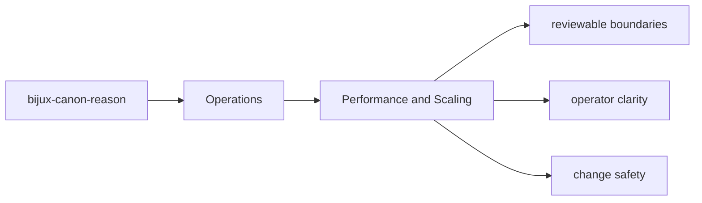
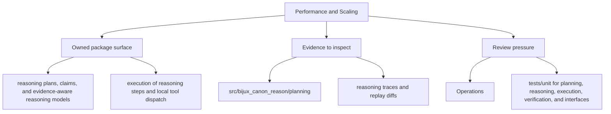

# Performance and Scaling

Performance work should preserve the deterministic and contract-driven behavior the package already promises.

## Page Maps

## Performance Review Anchors

- inspect workflow modules before optimizing boundary code blindly
- use the package tests that exercise realistic workloads
- treat artifact and contract drift as a regression even when performance improves

## Test Anchors

- tests/unit for planning, reasoning, execution, verification, and interfaces
- tests/e2e for API, CLI, replay gates, retrieval reasoning, and smoke coverage
- tests/perf for retrieval benchmark coverage
- tests/docs for documentation-linked safeguards

## What This Page Answers

- how bijux-canon-reason is installed, run, diagnosed, and released
- which files or tests matter during package operation
- where an operator should look when behavior changes

## Purpose

This page records the posture for performance work in `bijux-canon-reason`.

## Stability

Keep it aligned with the package's actual performance-sensitive paths and validation surfaces.
