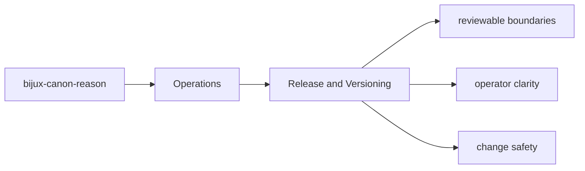

# Release and Versioning

Release work for `bijux-canon-reason` depends on package metadata, tracked release notes, and
the repository's commit conventions.

## Page Maps

## Release Anchors

- README.md
- CHANGELOG.md
- pyproject.toml

## Versioning Anchors

- version file: `packages/bijux-canon-reason/src/bijux_canon_reason/_version.py`
- tag pattern is configured in `packages/bijux-canon-reason/pyproject.toml`

## Purpose

This page ties package-local release mechanics to the wider repository release model.

## Stability

Keep it aligned with the package metadata and current versioning configuration.
