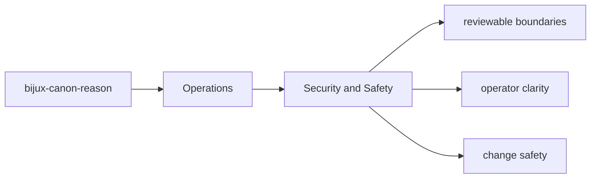
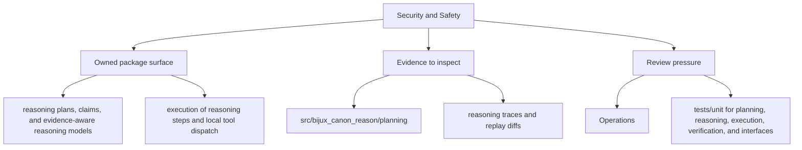

# Security and Safety

Security review in `bijux-canon-reason` should focus on the package's real boundary surfaces and outputs.

## Page Maps

## Review Anchors

- CLI app in src/bijux_canon_reason/interfaces/cli
- HTTP app in src/bijux_canon_reason/api/v1
- schema files in apis/bijux-canon-reason/v1

## Safety Rule

Any change that broadens package authority should update docs, tests, and release notes together.

## Purpose

This page keeps security review grounded in concrete package seams.

## Stability

Keep it aligned with the package interfaces and operational risk profile.
