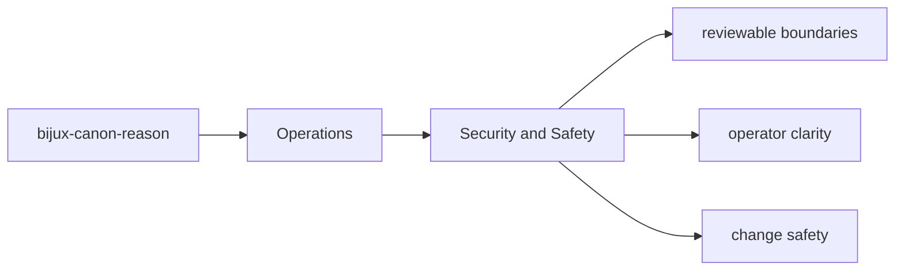
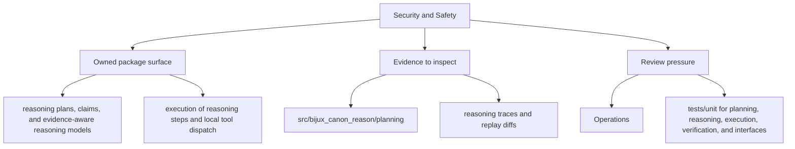

# Security and Safety

Security review in `bijux-canon-reason` should focus on the package's real boundary surfaces and outputs.

## Page Maps

## Review Anchors

- CLI app in src/bijux_canon_reason/interfaces/cli
- HTTP app in src/bijux_canon_reason/api/v1
- schema files in apis/bijux-canon-reason/v1

## Safety Rule

Any change that broadens package authority should update docs, tests, and release notes together.

## Concrete Anchors

- `packages/bijux-canon-reason/pyproject.toml` for package metadata
- `packages/bijux-canon-reason/README.md` for local package framing
- `packages/bijux-canon-reason/tests` for executable operational backstops

## Use This Page When

- you are installing, running, diagnosing, or releasing the package
- you need operational anchors rather than conceptual framing
- you are responding to package behavior in a local or CI environment

## Next Checks

- move to interfaces when the operational path depends on a specific surface contract
- move to quality when the question becomes whether the workflow is sufficiently proven
- move back to architecture when operational complexity suggests a structural problem

## Update This Page When

- install, setup, diagnostics, or release behavior changes materially
- package metadata or runtime workflow changes the expected operator path
- new operational constraints appear that a maintainer needs to know before acting

## What This Page Answers

- how bijux-canon-reason is installed, run, diagnosed, and released
- which files or tests matter during package operation
- where an operator should look when behavior changes

## Reviewer Lens

- verify that setup, workflow, and release references still match package metadata
- check that operational docs point at current diagnostics and validation paths
- confirm that release-facing claims match the package's actual versioning files

## Honesty Boundary

This page explains how bijux-canon-reason is expected to be operated, but it does not replace package metadata, runtime behavior, or validation runs in a real environment.

## Purpose

This page keeps security review grounded in concrete package seams.

## Stability

Keep it aligned with the package interfaces and operational risk profile.

## Core Claim

The operational claim of `bijux-canon-reason` is that install, run, diagnose, and release paths can be repeated from explicit package assets instead of oral history.

## Why It Matters

If the operations pages for `bijux-canon-reason` are weak, maintainers end up relearning install, diagnose, and release behavior from trial and error instead of from checked-in package truth.

## If It Drifts

- maintainers relearn package operation by trial and error
- release and setup steps quietly diverge from the checked-in package metadata
- diagnostic workflows become harder to repeat under incident pressure

## Representative Scenario

A maintainer is trying to run, diagnose, or release `bijux-canon-reason` under time pressure and needs an explicit path that starts from checked-in metadata and lands in repeatable validation.

## Source Of Truth Order

- `packages/bijux-canon-reason/pyproject.toml` for install and release metadata
- `packages/bijux-canon-reason/README.md` and package tests for operator truth
- this page for the repeatable workflow narrative that should match those assets

## Common Misreadings

- that the shortest operator path is the same thing as the most authoritative source
- that setup or release behavior can be inferred without checking package metadata
- that passing one local run proves the operational contract is fully intact
