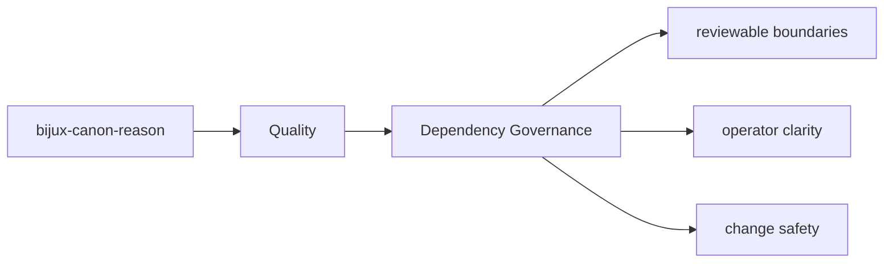
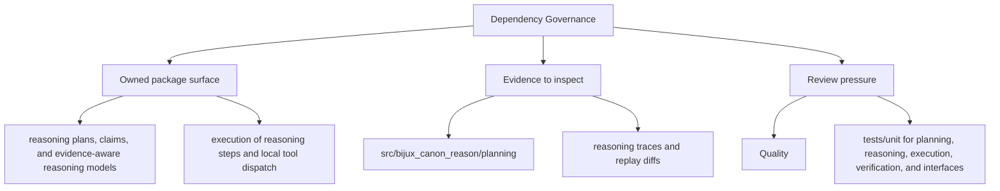

# Dependency Governance

Dependency changes in `bijux-canon-reason` should be treated as contract changes when they
alter package authority, operational risk, or public setup expectations.

## Page Maps

## Current Dependency Themes

- pydantic
- typer
- fastapi

## What This Page Answers

- what proves the bijux-canon-reason contract today
- which risks or limits still need explicit review
- what a reviewer should verify before accepting change

## Purpose

This page explains why dependency review matters for the package.

## Stability

Keep it aligned with `pyproject.toml` and the package's real dependency posture.
